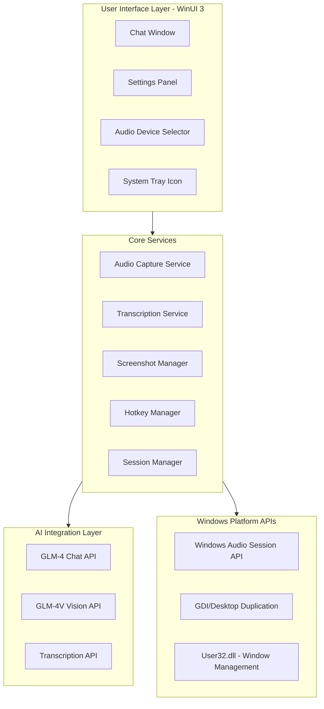
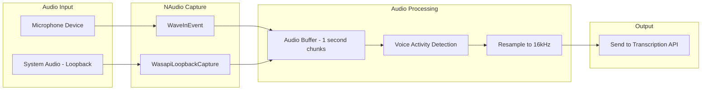
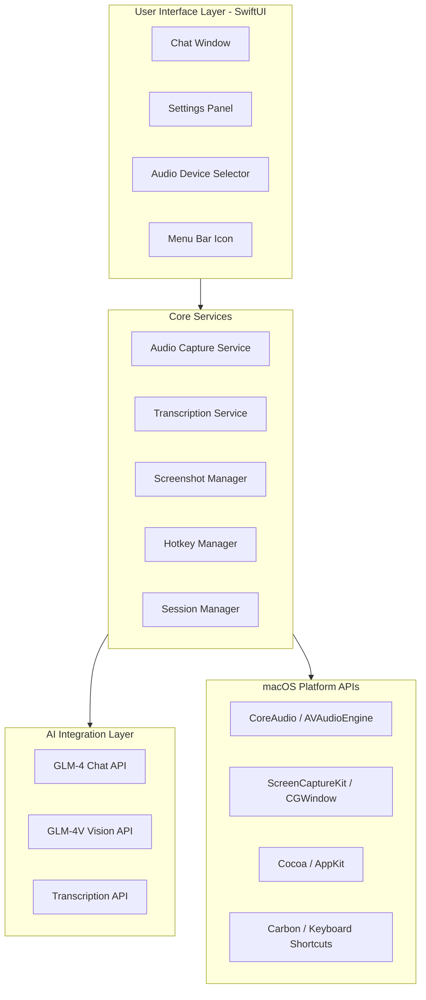

# Personal Clone - Technical Architecture Plan

## Executive Summary

This document outlines the technical architecture for building Personal as **two native applications** - one for Windows and one for macOS. This approach provides maximum reliability for the critical screen share invisibility feature on both platforms.

---

## Architecture Decision: Two Native Apps

Based on the cross-platform analysis, I recommend building **two separate native applications**:

### Windows App: C# + WinUI 3
- **Technology**: C# with WinUI 3 (Windows App SDK)
- **Screen hide**: `SetWindowDisplayAffinity` - reliable
- **Audio**: NAudio library
- **Distribution**: .exe installer / MSIX package
- **Development**: Visual Studio 2022+

### macOS App: Swift + SwiftUI
- **Technology**: Swift with SwiftUI
- **Screen hide**: `NSWindowSharingNone` (with limitations)
- **Audio**: AVAudioEngine
- **Distribution**: .app bundle
- **Development**: Xcode

### Why Two Native Apps?

1. **Maximum reliability on Windows** - `SetWindowDisplayAffinity` works perfectly
2. **Direct control over macOS implementation** - Can test and iterate quickly
3. **Clear expectations about macOS limitations** - Apple's ScreenCaptureKit limitation is documented
4. **Native performance** - Best audio capture and processing on each platform
5. **Modern Windows UI** - WinUI 3 provides Fluent Design System and latest Windows UX patterns

---

## Speech-to-Text Configuration

### Overview

The application supports multiple speech-to-text backends with a configuration menu that allows users to select their preferred transcription provider. **Important: GLM-4 does NOT provide speech-to-text capabilities** - it is a text-based LLM only.

### Default Configuration (Free)

The application comes pre-configured with **Whisper Local (whisper.cpp)** as the default free option:

| Provider | Cost | Offline | Languages | Latency | Recommended |
|----------|------|---------|-----------|---------|-------------|
| **Whisper Local (whisper.cpp)** | Free | Yes | PT/EN | ~300-500ms | **Default** |
| Vosk | Free | Yes | PT/EN | ~200-400ms | Alternative |
| Azure Speech Services | 5h/month free | No | 100+ | ~300ms | Cloud option |
| OpenAI Whisper API | Paid | No | 99 | ~2-5s | Premium option |

### Speech-to-Text Providers

#### 1. Whisper Local (whisper.cpp) - Recommended Default

**Pros:**
- Completely free
- Works offline
- Good Portuguese and English support
- Low latency for real-time use

**Cons:**
- Requires downloading model files (~75MB-1.5GB depending on model size)
- Uses CPU/GPU resources

#### 2. Vosk - Free Alternative

**Pros:**
- Free and offline
- Lightweight models available
- Good for Portuguese

**Cons:**
- Less accurate than Whisper
- Smaller language support

#### 3. Azure Speech Services - Cloud Option

**Free Tier:** 5 hours/month

**Pros:**
- Excellent accuracy
- Built-in speaker diarization
- Real-time streaming

**Cons:**
- Requires internet
- Limited free tier (5h/month)
- Need Azure subscription

#### 4. OpenAI Whisper API - Premium Option

**Pros:**
- Best accuracy available
- Supports many languages

**Cons:**
- Paid only (no free tier)
- Higher latency (~2-5s)
- Requires internet

---

## Windows Architecture (C# + WinUI 3)

### System Architecture



### Core Components

#### 1. Screen Share Invisibility (CRITICAL)

```csharp
// Using Windows API SetWindowDisplayAffinity
[DllImport("user32.dll")]
public static extern bool SetWindowDisplayAffinity(IntPtr hWnd, uint dwAffinity);

// WDA_EXCLUDEFROMCAPTURE = 0x00000011
private const uint WDA_EXCLUDEFROMCAPTURE = 0x11;

// Apply to main window and all child windows
protected override void OnSourceInitialized(EventArgs e)
{
    base.OnSourceInitialized(e);
    var hwnd = new WindowInteropHelper(this).Handle;
    SetWindowDisplayAffinity(hwnd, WDA_EXCLUDEFROMCAPTURE);
}
```

**Important Considerations:**
- **Windows App SDK Requirement**: Windows 10 version 1809 (build 17763) or later
- This API works on Windows 10 version 2004+ and Windows 11
- Must be applied to ALL windows including popups, dialogs, and tooltips
- Test thoroughly with Zoom, Teams, Meet, and Discord screen sharing

#### 2. Audio Capture System



**Key Implementation Details:**
- Use NAudio library for audio capture
- `WaveInEvent` for microphone capture
- `WasapiLoopbackCapture` for system audio
- Buffer audio in 1-second chunks for efficient API usage
- Implement Voice Activity Detection to reduce API costs

#### 3. Hotkey System

| Hotkey | Function | Description |
|--------|----------|-------------|
| CTRL+D | Start/Stop Transcription | Toggle audio capture and transcription |
| CTRL+B | Send Context to AI | Send accumulated transcription to AI for analysis |
| CTRL+E | Screenshot | Capture screen and store in session |
| CTRL+H | Hide/Show Window | Toggle main window visibility |

```csharp
// Using LowLevelKeyboardHook for global hotkeys
public class GlobalHotkeyManager
{
    [DllImport("user32.dll")]
    private static extern short GetAsyncKeyState(int vKey);

    public void RegisterHotkey(ModifierKeys modifiers, Key key, Action callback)
    {
        // Implementation using SetWindowsHookEx
    }
}
```

---

## macOS Architecture (Swift + SwiftUI)

### System Architecture



### Core Components

#### 1. Screen Share Invisibility (CRITICAL)

**Implementation Approach (Recommended by Gemini):**

```swift
import SwiftUI

@main
struct PersonalApp: App {
    init() {
        // Hide from dock and App Switcher (Command+Tab)
        NSApp.setActivationPolicy(.accessory)
    }

    var body: some Scene {
        WindowGroup {
            ContentView()
                .onAppear {
                    DispatchQueue.main.async {
                        NSApplication.shared.windows.forEach { window in
                            window.sharingType = .none
                        }
                    }
                }
        }
    }
}
```

**Alternative: Info.plist Approach (More Robust):**

Add to `Info.plist`:
```xml
<key>LSUIElement</key>
<true/>
```

This prevents the app icon from "flashing" in the Dock during startup.

**Important Considerations:**
- This API works on macOS 10.15+ (Catalina)
- **Reliability**: Works with most screen sharing apps (Zoom, Teams, Meet, Discord)
- Must be applied to ALL windows including popups, dialogs, and tooltips
- Test thoroughly with all target platforms

**Known Limitation:**
- Apps using ScreenCaptureKit (macOS 12.3+) for **screen recording** (OBS, QuickTime) may still capture the window
- This limitation affects **recording**, not necessarily **live screen sharing** in video conferencing apps
- The original Personal product documents this same limitation in their terms of service

#### 2. Audio Capture System

```swift
import AVFoundation

class AudioCaptureManager: ObservableObject {
    private var audioEngine: AVAudioEngine?
    private var inputNode: AVAudioInputNode?

    func startCapture() {
        audioEngine = AVAudioEngine()
        inputNode = audioEngine?.inputNode

        // Install tap on audio node
        inputNode?.installTap(onBus: 0, bufferSize: 1024, format: nil) { buffer, time in
            // Process audio buffer
        }

        try? audioEngine?.start()
    }
}
```

**Key Implementation Details:**
- Use AVAudioEngine for audio capture
- `AVAudioInputNode` for microphone capture
- For system audio loopback, may require BlackHole or Loopback virtual audio driver
- Buffer audio in 1-second chunks for efficient API usage

#### 3. Hotkey System

| Hotkey | Function | Description |
|--------|----------|-------------|
| CMD+D | Start/Stop Transcription | Toggle audio capture and transcription |
| CMD+B | Send Context to AI | Send accumulated transcription to AI for analysis |
| CMD+E | Screenshot | Capture screen and store in session |
| CMD+H | Hide/Show Window | Toggle main window visibility |

```swift
import Carbon
import HotKey

class HotkeyManager {
    private var hotKeys: [HotKey] = []

    func registerHotkeys() {
        // CMD+D - Toggle transcription
        let hotkeyD = HotKey(keyEquivalent: [.command, .d], modifiers: .command)
        HotKey.register(hotkeyD) {
            // Toggle transcription
        }
    }
}
```

---

## macOS Limitation - Critical Finding

From the official Electron documentation for `setContentProtection()`:

> **macOS limitation**: "Unfortunately, due to an intentional change in macOS, newer Mac applications that use `ScreenCaptureKit` will capture your window despite `win.setContentProtection(true)`."

This means:
- **Zoom app on macOS**: Uses ScreenCaptureKit → **may capture your window**
- **Google Meet in Chrome on macOS**: Uses ScreenCaptureKit → **may capture your window**
- **Teams app on macOS**: Uses ScreenCaptureKit → **may capture your window**

**This is not a framework limitation - it is an Apple design decision.**

### Potential macOS Solutions

| Approach | Reliability | Complexity | Best For |
|--------|-------------|------------|-------|
| NSWindowSharingNone | Medium | Simple | General |
| Secondary Window | Medium | Medium | Specific cases |
| Secure Text Field | High | Simple | Text only |
| Special window level | Low-Medium | Advanced | Advanced |
| Metal/OpenGL | Experimental | High | Advanced |

### My Honest Assessment

For macOS, the limitation is a fundamental issue that cannot be bypassed. However, there are some approaches that might help:

1. **Accept the limitation** - The macOS version will have the same limitation as the original Personal has. Add a clear disclaimer in the app about this

2. **Implement fallback mechanism** - Add a **quick-hide hotkey** (Ctrl+H) for when the user needs to hide the window quickly during screen sharing on macOS

3. **Test thoroughly** - The user should test the app with their specific video conferencing setup on macOS to understand the actual behavior

4. **Document clearly** - Let users know that the feature may not work reliably in some scenarios

---

## Shared Components (Both Platforms)

### AI Integration

**GLM-4 for Text Reasoning:**
- Model: `glm-4-flash` for fast responses
- Streaming: Yes, for real-time display
- Temperature: 0.7
- Max tokens: 1024

**GLM-4V for Image Analysis:**
- Model: `glm-4v` for vision
- Supports base64 image input
- Used for screenshot analysis

### Transcription Service

**Recommended Options:**

| Feature | Whisper Local | Azure Speech | OpenAI Whisper |
|---------|---------------|--------------|----------------|
| Real-time Streaming | Good | Excellent | No |
| Speaker Diarization | Requires post-processing | Built-in | Requires post-processing |
| Cost | Free | $$ | $ |
| Latency | ~300-500ms | ~300ms | ~2-5s |
| Language Support | 99+ | 100+ | 99+ |
| Offline | Yes | No | No |

---

## Assistant Profiles Configuration

The application supports multiple assistant profiles, each with specialized prompts for different use cases. Users can switch between profiles based on their current needs.

### Available Profiles

| Profile | Use Case | File |
|---------|----------|------|
| **General Assistant** | Everyday questions, explanations, code help | `general-assistant.md` |
| **LeetCode Coach** | Algorithm problems, interview prep | `leetcode-assistant.md` |
| **Note Taker** | Meeting summaries, action items | `note-taker.md` |
| **Study Assistant** | Academic learning, lectures | `study-assistant.md` |
| **Tech Candidate** | Technical interview roleplay | `tech-candidate.md` |

### Profile Structure

Each profile contains:
- **ROLE**: Defines the assistant's persona
- **TASK**: Primary objectives
- **STYLE**: Communication guidelines
- **WORKFLOW**: Step-by-step process
- **FORMAT**: Output structure
- **EXAMPLES**: Sample interactions

### Implementation

**Data Model:**
```csharp
public class AssistantProfile
{
    public string Id { get; set; }
    public string Name { get; set; }
    public string Description { get; set; }
    public string SystemPrompt { get; set; }
    public string Icon { get; set; }
    public bool IsBuiltIn { get; set; }
}
```

**Storage:**
- Built-in profiles stored as embedded resources
- Custom profiles stored in user settings directory
- Active profile stored in app settings

**UI Integration:**
- Profile selector dropdown in main window
- Settings page for managing profiles
- Import/Export functionality for custom profiles

### Profile Prompts Location

Store prompts in a dedicated folder:
```
Personal.Windows/
├── Prompts/
│   ├── general-assistant.md
│   ├── leetcode-assistant.md
│   ├── note-taker.md
│   ├── study-assistant.md
│   └── tech-candidate.md
```

---

## Project Structure

### Windows Project

```
Personal.Windows/
├── src/
│   ├── Core/
│   │   ├── AudioCaptureService.cs
│   │   ├── TranscriptionService.cs
│   │   ├── ScreenshotManager.cs
│   │   ├── HotkeyManager.cs
│   │   └── SessionManager.cs
│   ├── AI/
│   │   ├── GLM4Client.cs
│   │   ├── GLM4VClient.cs
│   │   └── PromptTemplates.cs
│   ├── UI/
│   │   ├── MainWindow.xaml
│   │   ├── MainWindowViewModel.cs
│   │   ├── ChatControl.xaml
│   │   ├── SettingsWindow.xaml
│   │   └── AudioDeviceSelector.xaml
│   ├── Platform/
│   │   ├── WindowExclusion.cs
│   │   ├── GlobalHotkeys.cs
│   │   └── AudioDevices.cs
│   └── Models/
│       ├── ChatMessage.cs
│       ├── TranscriptionSegment.cs
│       ├── AudioDevice.cs
│       └── Settings.cs
├── packages/
└── Personal.Windows.csproj
```

### macOS Project

```
Personal.macOS/
├── Sources/
│   ├── Core/
│   │   ├── AudioCaptureService.swift
│   │   ├── TranscriptionService.swift
│   │   ├── ScreenshotManager.swift
│   │   ├── HotkeyManager.swift
│   │   └── SessionManager.swift
│   ├── AI/
│   │   ├── GLM4Client.swift
│   │   ├── GLM4VClient.swift
│   │   └── PromptTemplates.swift
│   ├── Views/
│   │   ├── ContentView.swift
│   │   ├── ChatView.swift
│   │   ├── SettingsView.swift
│   │   └── AudioDeviceSelectorView.swift
│   ├── Platform/
│   │   ├── WindowExclusion.swift
│   │   ├── GlobalHotkeys.swift
│   │   └── AudioDevices.swift
│   └── Models/
│       ├── ChatMessage.swift
│       ├── TranscriptionSegment.swift
│       ├── AudioDevice.swift
│       └── Settings.swift
├── Tests/
└── Personal.macOS.xcodeproj
```

---

## Development Phases

### Phase 1: Windows MVP with WinUI 3
- [ ] Project setup with WinUI 3 (Windows App SDK)
- [ ] Window exclusion implementation (`SetWindowDisplayAffinity`)
- [ ] Test with Zoom, Teams, Meet on Windows
- [ ] Basic UI with chat interface
- [ ] Settings storage
- [ ] GLM-4 API integration

### Phase 2: Audio System (Windows)
- [ ] NAudio integration
- [ ] Audio device enumeration
- [ ] Microphone capture
- [ ] System audio loopback capture
- [ ] Audio buffering

### Phase 3: Transcription (Windows)
- [ ] Whisper Local integration (default)
- [ ] Azure Speech SDK integration (optional)
- [ ] Real-time transcription display
- [ ] Speaker diarization
- [ ] Transcription history

### Phase 4: macOS MVP with Swift/SwiftUI
- [ ] Project setup with SwiftUI
- [ ] Window exclusion implementation (`NSWindowSharingNone`)
- [ ] Test with Zoom, Teams, Meet on macOS
- [ ] Basic UI (same as Windows)
- [ ] Settings storage
- [ ] GLM-4 API integration

### Phase 5: Audio System (macOS)
- [ ] AVAudioEngine integration
- [ ] Audio device enumeration
- [ ] Microphone capture
- [ ] System audio capture (may require BlackHole/Loopback)
- [ ] Audio buffering

### Phase 6: Transcription (macOS)
- [ ] Whisper Local integration (default)
- [ ] Azure Speech SDK integration (optional)
- [ ] Real-time transcription display
- [ ] Speaker diarization
- [ ] Transcription history

### Phase 7: Polish (Both Platforms)
- [ ] Global hotkeys
- [ ] System tray / Menu bar
- [ ] Error handling
- [ ] Performance optimization
- [ ] Auto-update

### Phase 8: Testing
- [ ] Test with real Zoom, Teams, Meet calls on both platforms
- [ ] Document any limitations discovered
- [ ] Update user documentation

---

## Dependencies

### Windows (NuGet / Windows App SDK)

```xml
<!-- Windows App SDK - Included in project SDK -->
<!-- Project SDK: Microsoft.WindowsAppSDK -->

<!-- Additional NuGet packages -->
<PackageReference Include="NAudio" Version="2.2.1" />
<PackageReference Include="Whisper.net" Version="1.5.0" />
<PackageReference Include="Microsoft.CognitiveServices.Speech" Version="1.34.0" />
<PackageReference Include="Newtonsoft.Json" Version="13.0.3" />
<PackageReference Include="Microsoft.Extensions.DependencyInjection" Version="8.0.0" />
<PackageReference Include="CommunityToolkit.Mvvm" Version="8.2.2" />
<PackageReference Include="CommunityToolkit.WinUI.UI.Controls" Version="7.1.2" />
```

### macOS (Swift Package Manager)

```swift
dependencies: [
    .package(url: "https://github.com/Azure-Samples/cognitive-services-speech-sdk", from: "1.34.0"),
]
```

---

## API Costs Estimation

| Service | Usage Pattern | Estimated Monthly Cost |
|---------|---------------|------------------------|
| GLM-4-Flash | ~50k tokens/day | ~$15-30 |
| GLM-4V | ~100 images/day | ~$5-10 |
| Whisper Local | Unlimited | $0 (free, offline) |
| Azure Speech (if used) | ~2 hours/day | ~$10-20 |
| **Total (with Whisper Local)** | | **~$20-40/month** |
| **Total (with Azure Speech)** | | **~$30-60/month** |

---

## Security Considerations

### Windows
- **API Key Storage**: Use Windows Credential Manager for secure storage
- **Audio Data**: Process in memory, do not persist to disk
- **Screenshots**: Store only in session memory, clear on exit
- **Network**: Use HTTPS for all API calls

### macOS
- **API Key Storage**: Use Keychain for secure storage
- **Audio Data**: Process in memory, do not persist to disk
- **Screenshots**: Store only in session memory, clear on exit
- **Network**: Use HTTPS for all API calls

---

## Open Questions

1. **Language Preference**: Should the AI respond in Portuguese or English by default?
2. **Transcription Language**: Primary language for transcription - Portuguese or English?
3. **Azure Region**: Which Azure region is closest to you for Speech Services?
4. **Screenshot Storage**: Should screenshots persist between sessions or be session-only?
5. **macOS System Audio**: Should we require BlackHole/Loopback for system audio capture on macOS?

---

## References

- [Personal Research Document](personal_research.md) - Original product research
- [Windows Implementation Plan](windows-implementation-plan.md) - Detailed Windows implementation
- [GLM-4 API Documentation](https://bigmodel.cn/dev/api/normal-model/glm-4)
- [GLM-4V Vision API](https://bigmodel.cn/dev/api/multimodal-model/glm-4v)
- [Azure Speech Services](https://learn.microsoft.com/en-us/azure/ai-services/speech-service/)
- [Whisper.cpp GitHub](https://github.com/ggerganov/whisper.cpp)
- [Whisper.net NuGet](https://www.nuget.org/packages/Whisper.net)
