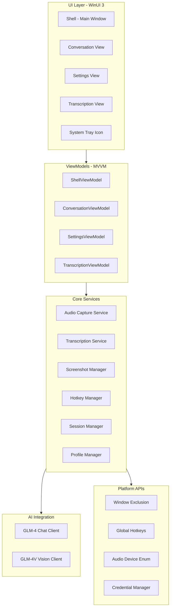

# Personal Windows - Implementation Plan

## Executive Summary

This document provides a detailed implementation plan for the Personal Windows application using WinUI 3 and C#. The application provides an AI-powered assistant that remains invisible during screen sharing sessions.

---

## Architecture Overview



---

## Current Template Analysis

### Existing Files

| File | Purpose | Status |
|------|---------|--------|
| [`App.xaml`](../src/Personal.Windows/App.xaml) | Application resources | Needs enhancement |
| [`App.xaml.cs`](../src/Personal.Windows/App.xaml.cs) | App entry point | Needs DI setup |
| [`Views/MainPage.xaml`](../src/Personal.Windows/Views/MainPage.xaml) | Main page UI | Replace with Shell |
| [`Views/MainPage.xaml.cs`](../src/Personal.Windows/Views/MainPage.xaml.cs) | Main page code | Replace with Shell |
| [`Personal.Windows.csproj`](../src/Personal.Windows/Personal.Windows.csproj) | Project file | Needs NuGet packages |
| [`Package.appxmanifest`](../src/Personal.Windows/Package.appxmanifest) | App manifest | Needs capabilities |

### Required Enhancements

1. **App.xaml.cs**: Add dependency injection container setup
2. **Project file**: Add required NuGet packages
3. **Package.appxmanifest**: Add microphone and screenshot capabilities

---

## Complete Folder Structure

```
src/Personal.Windows/
├── App.xaml                          # Enhanced with theme resources
├── App.xaml.cs                       # Enhanced with DI setup
├── Imports.cs                        # Global usings
├── Personal.Windows.csproj           # Enhanced with NuGet packages
├── Package.appxmanifest              # Enhanced with capabilities
│
├── Assets/                           # Existing assets
│
├── Models/                           # Data models
│   ├── ChatMessage.cs
│   ├── TranscriptionSegment.cs
│   ├── AudioDevice.cs
│   ├── AssistantProfile.cs
│   ├── AppSettings.cs
│   └── SessionContext.cs
│
├── ViewModels/                       # MVVM ViewModels
│   ├── ViewModelBase.cs
│   ├── ShellViewModel.cs
│   ├── ConversationViewModel.cs
│   ├── TranscriptionViewModel.cs
│   └── SettingsViewModel.cs
│
├── Views/                            # WinUI 3 Views
│   ├── Shell.xaml                    # Main shell window
│   ├── Shell.xaml.cs
│   ├── Pages/
│   │   ├── ConversationPage.xaml
│   │   ├── ConversationPage.xaml.cs
│   │   ├── TranscriptionPage.xaml
│   │   ├── TranscriptionPage.xaml.cs
│   │   ├── SettingsPage.xaml
│   │   └── SettingsPage.xaml.cs
│   └── Controls/
│       ├── ChatBubble.xaml
│       ├── ChatBubble.xaml.cs
│       ├── TranscriptionItem.xaml
│       ├── TranscriptionItem.xaml.cs
│       ├── AudioDeviceSelector.xaml
│       ├── AudioDeviceSelector.xaml.cs
│       └── ProfileSelector.xaml
│       └── ProfileSelector.xaml.cs
│
├── Services/                         # Core services
│   ├── IAudioCaptureService.cs
│   ├── AudioCaptureService.cs
│   ├── ITranscriptionService.cs
│   ├── TranscriptionService.cs
│   ├── IScreenshotManager.cs
│   ├── ScreenshotManager.cs
│   ├── IHotkeyManager.cs
│   ├── HotkeyManager.cs
│   ├── ISessionManager.cs
│   ├── SessionManager.cs
│   └── IProfileManager.cs
│       └── ProfileManager.cs
│
├── AI/                               # AI integration
│   ├── IGLM4Client.cs
│   ├── GLM4Client.cs
│   ├── IGLM4VClient.cs
│   ├── GLM4VClient.cs
│   └── PromptTemplates.cs
│
├── Platform/                         # Windows-specific APIs
│   ├── WindowExclusion.cs            # SetWindowDisplayAffinity
│   ├── GlobalHotkeyHook.cs           # Low-level keyboard hook
│   ├── AudioDeviceEnumerator.cs      # WASAPI device enum
│   └── SecureCredentialStorage.cs    # Windows Credential Manager
│
├── Converters/                       # Value converters
│   ├── BoolToVisibilityConverter.cs
│   └── MessageRoleToAlignmentConverter.cs
│
├── Helpers/                          # Utility classes
│   ├── AudioBuffer.cs
│   └── VoiceActivityDetector.cs
│
└── Prompts/                          # Assistant profile prompts
    ├── general-assistant.md
    ├── leetcode-assistant.md
    ├── note-taker.md
    ├── study-assistant.md
    └── tech-candidate.md
```

---

## Files to Create - Detailed List

### Phase 1: Foundation and Infrastructure

| File | Description |
|------|-------------|
| `Models/AppSettings.cs` | Application settings model |
| `Models/AudioDevice.cs` | Audio device information model |
| `ViewModels/ViewModelBase.cs` | Base class for ViewModels |
| `Platform/WindowExclusion.cs` | Screen share invisibility API |
| `Services/ISessionManager.cs` | Session management interface |
| `Services/SessionManager.cs` | Session state management |

### Phase 2: UI Shell and Navigation

| File | Description |
|------|-------------|
| `Views/Shell.xaml` | Main application shell |
| `Views/Shell.xaml.cs` | Shell code-behind |
| `ViewModels/ShellViewModel.cs` | Shell ViewModel |
| `Views/Pages/ConversationPage.xaml` | Main conversation view |
| `Views/Pages/ConversationPage.xaml.cs` | Conversation code-behind |
| `ViewModels/ConversationViewModel.cs` | Conversation ViewModel |
| `Models/ChatMessage.cs` | Chat message model |

### Phase 3: AI Integration

| File | Description |
|------|-------------|
| `AI/IGLM4Client.cs` | GLM-4 client interface |
| `AI/GLM4Client.cs` | GLM-4 API implementation |
| `AI/IGLM4VClient.cs` | GLM-4V client interface |
| `AI/GLM4VClient.cs` | GLM-4V Vision API implementation |
| `AI/PromptTemplates.cs` | System prompt templates |
| `Models/AssistantProfile.cs` | Profile model |

### Phase 4: Audio System

| File | Description |
|------|-------------|
| `Services/IAudioCaptureService.cs` | Audio capture interface |
| `Services/AudioCaptureService.cs` | NAudio implementation |
| `Platform/AudioDeviceEnumerator.cs` | Device enumeration |
| `Helpers/AudioBuffer.cs` | Audio chunk buffering |
| `Helpers/VoiceActivityDetector.cs` | VAD implementation |
| `Views/Controls/AudioDeviceSelector.xaml` | Device selector UI |
| `Views/Controls/AudioDeviceSelector.xaml.cs` | Selector code-behind |

### Phase 5: Transcription

| File | Description |
|------|-------------|
| `Services/ITranscriptionService.cs` | Transcription interface |
| `Services/TranscriptionService.cs` | Azure Speech implementation |
| `Models/TranscriptionSegment.cs` | Transcription model |
| `Views/Pages/TranscriptionPage.xaml` | Transcription view |
| `Views/Pages/TranscriptionPage.xaml.cs` | Transcription code-behind |
| `ViewModels/TranscriptionViewModel.cs` | Transcription ViewModel |
| `Views/Controls/TranscriptionItem.xaml` | Transcription item control |
| `Views/Controls/TranscriptionItem.xaml.cs` | Item code-behind |

### Phase 6: Screenshot and Vision

| File | Description |
|------|-------------|
| `Services/IScreenshotManager.cs` | Screenshot interface |
| `Services/ScreenshotManager.cs` | Screenshot implementation |
| `Models/SessionContext.cs` | Session context with screenshots |

### Phase 7: Hotkeys and System Tray

| File | Description |
|------|-------------|
| `Services/IHotkeyManager.cs` | Hotkey interface |
| `Services/HotkeyManager.cs` | Hotkey implementation |
| `Platform/GlobalHotkeyHook.cs` | Low-level keyboard hook |

### Phase 8: Settings and Profiles

| File | Description |
|------|-------------|
| `Views/Pages/SettingsPage.xaml` | Settings view |
| `Views/Pages/SettingsPage.xaml.cs` | Settings code-behind |
| `ViewModels/SettingsViewModel.cs` | Settings ViewModel |
| `Services/IProfileManager.cs` | Profile management interface |
| `Services/ProfileManager.cs` | Profile management implementation |
| `Views/Controls/ProfileSelector.xaml` | Profile selector UI |
| `Views/Controls/ProfileSelector.xaml.cs` | Selector code-behind |
| `Platform/SecureCredentialStorage.cs` | Credential storage |

### Phase 9: Converters and Helpers

| File | Description |
|------|-------------|
| `Converters/BoolToVisibilityConverter.cs` | Boolean to visibility |
| `Converters/MessageRoleToAlignmentConverter.cs` | Message alignment |

### Phase 10: Embedded Resources

| File | Description |
|------|-------------|
| `Prompts/general-assistant.md` | General assistant prompt |
| `Prompts/leetcode-assistant.md` | LeetCode coach prompt |
| `Prompts/note-taker.md` | Meeting notes prompt |
| `Prompts/study-assistant.md` | Study assistant prompt |
| `Prompts/tech-candidate.md` | Interview roleplay prompt |

---

## Key Interfaces and Classes

### Core Interfaces

```csharp
// Services/IAudioCaptureService.cs
public interface IAudioCaptureService
{
    event EventHandler<AudioDataEventArgs>? AudioDataAvailable;
    event EventHandler? CaptureStateChanged;
    
    bool IsCapturing { get; }
    IReadOnlyList<AudioDevice> InputDevices { get; }
    IReadOnlyList<AudioDevice> LoopbackDevices { get; }
    
    Task StartCaptureAsync(AudioDevice? inputDevice = null, AudioDevice? loopbackDevice = null);
    Task StopCaptureAsync();
    Task RefreshDevicesAsync();
}

// Services/ITranscriptionService.cs
public interface ITranscriptionService
{
    event EventHandler<TranscriptionEventArgs>? TranscriptionReceived;
    event EventHandler<TranscriptionErrorEventArgs>? TranscriptionError;
    
    bool IsTranscribing { get; }
    
    Task StartTranscriptionAsync(Stream audioStream);
    Task StopTranscriptionAsync();
}

// Services/IHotkeyManager.cs
public interface IHotkeyManager
{
    void RegisterHotkey(HotkeyAction action, Action callback);
    void UnregisterHotkey(HotkeyAction action);
    void UnregisterAll();
}

// AI/IGLM4Client.cs
public interface IGLM4Client
{
    IAsyncEnumerable<string> StreamCompletionAsync(string systemPrompt, IEnumerable<ChatMessage> messages);
    Task<string> CompleteAsync(string systemPrompt, IEnumerable<ChatMessage> messages);
    void SetApiKey(string apiKey);
}

// Services/ISessionManager.cs
public interface ISessionManager
{
    SessionContext CurrentSession { get; }
    void AddTranscription(string text, string speaker);
    void AddScreenshot(byte[] imageData);
    void ClearSession();
}
```

### Key Classes

```csharp
// Models/ChatMessage.cs
public class ChatMessage
{
    public string Id { get; set; } = Guid.NewGuid().ToString();
    public MessageRole Role { get; set; }
    public string Content { get; set; } = string.Empty;
    public DateTime Timestamp { get; set; } = DateTime.UtcNow;
    public List<ScreenshotAttachment>? Screenshots { get; set; }
}

public enum MessageRole { User, Assistant }

// Models/TranscriptionSegment.cs
public class TranscriptionSegment
{
    public string Id { get; set; } = Guid.NewGuid().ToString();
    public string Text { get; set; } = string.Empty;
    public string Speaker { get; set; } = "Unknown";
    public DateTime Timestamp { get; set; } = DateTime.UtcNow;
    public double Confidence { get; set; }
    public TimeSpan Duration { get; set; }
}

// Models/AppSettings.cs
public class AppSettings
{
    public string ApiKey { get; set; } = string.Empty;
    public string ActiveProfileId { get; set; } = "general-assistant";
    public string? PreferredInputDeviceId { get; set; }
    public string? PreferredLoopbackDeviceId { get; set; }
    public bool ShowInSystemTray { get; set; } = true;
    public HotkeyBindings Hotkeys { get; set; } = new();
}

// Platform/WindowExclusion.cs
public static class WindowExclusion
{
    private const uint WDA_EXCLUDEFROMCAPTURE = 0x11;
    
    [DllImport("user32.dll")]
    private static extern bool SetWindowDisplayAffinity(IntPtr hWnd, uint dwAffinity);
    
    public static bool ExcludeFromCapture(IntPtr windowHandle)
    {
        return SetWindowDisplayAffinity(windowHandle, WDA_EXCLUDEFROMCAPTURE);
    }
}
```

---

## WinUI 3 Specific Implementations

### 1. Screen Share Invisibility

The critical feature using Windows API:

```csharp
// Platform/WindowExclusion.cs
public static class WindowExclusion
{
    private const uint WDA_EXCLUDEFROMCAPTURE = 0x11;
    
    [DllImport("user32.dll")]
    private static extern bool SetWindowDisplayAffinity(IntPtr hWnd, uint dwAffinity);
    
    public static bool ExcludeFromCapture(IntPtr windowHandle)
    {
        return SetWindowDisplayAffinity(windowHandle, WDA_EXCLUDEFROMCAPTURE);
    }
    
    public static void ApplyToWindow(Window window)
    {
        var hwnd = WinRT.Interop.WindowNative.GetWindowHandle(window);
        ExcludeFromCapture(hwnd);
    }
}
```

Apply in Shell.xaml.cs:
```csharp
protected override void OnNavigatedTo(NavigationEventArgs e)
{
    base.OnNavigatedTo(e);
    WindowExclusion.ApplyToWindow(App.MainWindow);
}
```

### 2. Audio Recording with NAudio

```csharp
// Services/AudioCaptureService.cs
public class AudioCaptureService : IAudioCaptureService, IDisposable
{
    private WaveInEvent? _microphoneCapture;
    private WasapiLoopbackCapture? _loopbackCapture;
    private readonly AudioBuffer _buffer = new();
    
    public async Task StartCaptureAsync(AudioDevice? inputDevice, AudioDevice? loopbackDevice)
    {
        // Microphone capture
        _microphoneCapture = new WaveInEvent
        {
            WaveFormat = new WaveFormat(16000, 16, 1)
        };
        _microphoneCapture.DataAvailable += OnMicrophoneData;
        _microphoneCapture.StartRecording();
        
        // System audio loopback
        _loopbackCapture = new WasapiLoopbackCapture();
        _loopbackCapture.DataAvailable += OnLoopbackData;
        _loopbackCapture.StartRecording();
    }
}
```

### 3. Speech-to-Text with Azure Speech SDK

```csharp
// Services/TranscriptionService.cs
public class TranscriptionService : ITranscriptionService
{
    private SpeechRecognizer? _recognizer;
    private readonly SpeechConfig _speechConfig;
    
    public TranscriptionService(string subscriptionKey, string region)
    {
        _speechConfig = SpeechConfig.FromSubscription(subscriptionKey, region);
        _speechConfig.SpeechRecognitionLanguage = "en-US";
    }
    
    public async Task StartTranscriptionAsync(Stream audioStream)
    {
        var audioFormat = AudioStreamFormat.GetWaveFormatPCM(16000, 16, 1);
        var audioInputStream = AudioInputStream.CreatePushStream(audioFormat);
        var audioConfig = AudioConfig.FromStreamInput(audioInputStream);
        
        _recognizer = new SpeechRecognizer(_speechConfig, audioConfig);
        _recognizer.Recognizing += OnRecognizing;
        _recognizer.Recognized += OnRecognized;
        
        await _recognizer.StartContinuousRecognitionAsync();
    }
}
```

### 4. State Management with CommunityToolkit.Mvvm

```csharp
// ViewModels/ConversationViewModel.cs
public partial class ConversationViewModel : ObservableObject
{
    [ObservableProperty]
    private ObservableCollection<ChatMessage> _messages = new();
    
    [ObservableProperty]
    [NotifyPropertyChangedFor(nameof(IsNotSending))]
    private bool _isSending;
    
    public bool IsNotSending => !IsSending;
    
    [RelayCommand]
    private async Task SendMessageAsync(string content)
    {
        IsSending = true;
        var message = new ChatMessage { Role = MessageRole.User, Content = content };
        Messages.Add(message);
        
        await ProcessWithAIAsync(message);
        IsSending = false;
    }
}
```

---

## UI Components

### Shell - Main Window Container

The Shell provides navigation and hosts the main content area.

```xml
<!-- Views/Shell.xaml -->
<Window x:Class="Personal.Windows.Views.Shell">
    <Grid>
        <Grid.RowDefinitions>
            <RowDefinition Height="Auto"/>
            <RowDefinition Height="*"/>
            <RowDefinition Height="Auto"/>
        </Grid.RowDefinitions>
        
        <!-- Title Bar -->
        <Grid x:Name="TitleBar" Grid.Row="0"/>
        
        <!-- Navigation View -->
        <NavigationView Grid.Row="1" IsBackButtonVisible="Collapsed">
            <NavigationView.MenuItems>
                <NavigationViewItem Icon="Chat" Content="Conversation"/>
                <NavigationViewItem Icon="Microphone" Content="Transcription"/>
                <NavigationViewItem Icon="Setting" Content="Settings"/>
            </NavigationView.MenuItems>
            
            <Frame x:Name="ContentFrame"/>
        </NavigationView>
        
        <!-- Status Bar -->
        <StatusBar Grid.Row="2">
            <StatusBarItem Content="{x:Bind ViewModel.StatusMessage}"/>
        </StatusBar>
    </Grid>
</Window>
```

### ConversationPage - Chat Interface

```xml
<!-- Views/Pages/ConversationPage.xaml -->
<Page x:Class="Personal.Windows.Views.Pages.ConversationPage">
    <Grid RowDefinitions="*, Auto">
        <!-- Messages List -->
        <ListView ItemsSource="{x:Bind ViewModel.Messages}"
                  SelectionMode="None">
            <ListView.ItemTemplate>
                <DataTemplate x:DataType="model:ChatMessage">
                    <local:ChatBubble Message="{x:Bind}"/>
                </DataTemplate>
            </ListView.ItemTemplate>
        </ListView>
        
        <!-- Input Area -->
        <Grid Grid.Row="1">
            <TextBox PlaceholderText="Type your message..."/>
            <Button Command="{x:Bind ViewModel.SendMessageCommand}">Send</Button>
        </Grid>
    </Grid>
</Page>
```

### TranscriptionPage - Real-time Transcription

```xml
<!-- Views/Pages/TranscriptionPage.xaml -->
<Page x:Class="Personal.Windows.Views.Pages.TranscriptionPage">
    <Grid RowDefinitions="Auto, *, Auto">
        <!-- Controls -->
        <StackPanel Orientation="Horizontal">
            <Button Command="{x:Bind ViewModel.StartTranscriptionCommand}"
                    IsEnabled="{x:Bind ViewModel.IsNotTranscribing}">
                Start Transcription
            </Button>
            <Button Command="{x:Bind ViewModel.StopTranscriptionCommand}"
                    IsEnabled="{x:Bind ViewModel.IsTranscribing}">
                Stop
            </Button>
        </StackPanel>
        
        <!-- Transcription List -->
        <ListView Grid.Row="1" ItemsSource="{x:Bind ViewModel.Segments}">
            <ListView.ItemTemplate>
                <DataTemplate x:DataType="model:TranscriptionSegment">
                    <local:TranscriptionItem Segment="{x:Bind}"/>
                </DataTemplate>
            </ListView.ItemTemplate>
        </ListView>
        
        <!-- Current Transcript -->
        <TextBlock Grid.Row="2" Text="{x:Bind ViewModel.CurrentText}"/>
    </Grid>
</Page>
```

### SettingsPage - Configuration

```xml
<!-- Views/Pages/SettingsPage.xaml -->
<Page x:Class="Personal.Windows.Views.Pages.SettingsPage">
    <StackPanel Spacing="16">
        <!-- API Settings -->
        <TextBlock Text="API Configuration" Style="{StaticResource SubtitleTextBlockStyle}"/>
        <PasswordBox Header="GLM-4 API Key" 
                     Password="{x:Bind ViewModel.ApiKey, Mode=TwoWay}"/>
        
        <!-- Audio Settings -->
        <TextBlock Text="Audio Devices" Style="{StaticResource SubtitleTextBlockStyle}"/>
        <local:AudioDeviceSelector/>
        
        <!-- Profile Settings -->
        <TextBlock Text="Assistant Profile" Style="{StaticResource SubtitleTextBlockStyle}"/>
        <local:ProfileSelector/>
        
        <!-- Hotkey Settings -->
        <TextBlock Text="Keyboard Shortcuts" Style="{StaticResource SubtitleTextBlockStyle}"/>
        <!-- Hotkey configuration items -->
    </StackPanel>
</Page>
```

---

## Dependency Injection Setup

### App.xaml.cs Enhancement

```csharp
// App.xaml.cs
public partial class App : Application
{
    public static Window MainWindow { get; private set; } = null!;
    public IServiceProvider Services { get; }
    
    public App()
    {
        Services = ConfigureServices();
        InitializeComponent();
    }
    
    private static IServiceProvider ConfigureServices()
    {
        var services = new ServiceCollection();
        
        // ViewModels
        services.AddTransient<ShellViewModel>();
        services.AddTransient<ConversationViewModel>();
        services.AddTransient<TranscriptionViewModel>();
        services.AddTransient<SettingsViewModel>();
        
        // Services
        services.AddSingleton<IAudioCaptureService, AudioCaptureService>();
        services.AddSingleton<ITranscriptionService, TranscriptionService>();
        services.AddSingleton<IScreenshotManager, ScreenshotManager>();
        services.AddSingleton<IHotkeyManager, HotkeyManager>();
        services.AddSingleton<ISessionManager, SessionManager>();
        services.AddSingleton<IProfileManager, ProfileManager>();
        
        // AI Clients
        services.AddSingleton<IGLM4Client, GLM4Client>();
        services.AddSingleton<IGLM4VClient, GLM4VClient>();
        
        // Platform Services
        services.AddSingleton<AudioDeviceEnumerator>();
        services.AddSingleton<SecureCredentialStorage>();
        
        return services.BuildServiceProvider();
    }
    
    protected override void OnLaunched(LaunchActivatedEventArgs e)
    {
        MainWindow = new Window();
        var shell = Services.GetRequiredService<Shell>();
        MainWindow.Content = shell;
        MainWindow.Activate();
        
        // Apply screen share exclusion
        WindowExclusion.ApplyToWindow(MainWindow);
    }
}
```

---

## NuGet Packages Required

Add to [`Personal.Windows.csproj`](../src/Personal.Windows/Personal.Windows.csproj):

```xml
<ItemGroup>
    <!-- Existing packages -->
    <PackageReference Include="Microsoft.WindowsAppSDK" Version="1.*" />
    <PackageReference Include="Microsoft.Web.WebView2" Version="1.*" />
    <PackageReference Include="Microsoft.Windows.SDK.BuildTools" Version="10.*" />
    
    <!-- Audio -->
    <PackageReference Include="NAudio" Version="2.2.1" />
    
    <!-- Speech Recognition -->
    <PackageReference Include="Microsoft.CognitiveServices.Speech" Version="1.34.0" />
    
    <!-- MVVM -->
    <PackageReference Include="CommunityToolkit.Mvvm" Version="8.2.2" />
    
    <!-- UI Controls -->
    <PackageReference Include="CommunityToolkit.WinUI.UI.Controls" Version="7.1.2" />
    
    <!-- Dependency Injection -->
    <PackageReference Include="Microsoft.Extensions.DependencyInjection" Version="8.0.0" />
    
    <!-- HTTP -->
    <PackageReference Include="Newtonsoft.Json" Version="13.0.3" />
</ItemGroup>
```

---

## Implementation Order

### Phase 1: Foundation
1. Update project file with NuGet packages
2. Create folder structure
3. Create Models - AppSettings, ChatMessage, AudioDevice
4. Create ViewModelBase
5. Implement WindowExclusion for screen share invisibility
6. Update App.xaml.cs with DI setup
7. Test screen share exclusion with Zoom/Teams

### Phase 2: Shell and Navigation
1. Create Shell.xaml and ShellViewModel
2. Implement NavigationView navigation
3. Create ConversationPage placeholder
4. Create SettingsPage placeholder
5. Test navigation flow

### Phase 3: AI Integration
1. Implement GLM4Client with streaming
2. Implement GLM4VClient for vision
3. Create PromptTemplates
4. Create AssistantProfile model
5. Test AI completion with sample prompts

### Phase 4: Conversation Feature
1. Implement ConversationViewModel
2. Create ChatBubble control
3. Wire up message sending
4. Display AI responses with streaming
5. Test conversation flow

### Phase 5: Audio System
1. Implement AudioDeviceEnumerator
2. Create AudioCaptureService with NAudio
3. Implement AudioBuffer for chunking
4. Create AudioDeviceSelector control
5. Test microphone and loopback capture

### Phase 6: Transcription
1. Implement TranscriptionService with Azure Speech
2. Create TranscriptionViewModel
3. Create TranscriptionPage
4. Create TranscriptionItem control
5. Test real-time transcription

### Phase 7: Screenshots and Vision
1. Implement ScreenshotManager
2. Integrate with GLM4VClient
3. Add screenshot attachment to messages
4. Test screenshot analysis

### Phase 8: Hotkeys and Tray
1. Implement GlobalHotkeyHook
2. Create HotkeyManager
3. Implement system tray icon
4. Test global hotkeys

### Phase 9: Settings and Profiles
1. Implement SettingsViewModel
2. Implement ProfileManager
3. Create ProfileSelector control
4. Implement SecureCredentialStorage
5. Test settings persistence

### Phase 10: Polish and Testing
1. Add converters
2. Error handling
3. Performance optimization
4. Full integration testing
5. Test with real video conferencing apps

---

## Hotkey Configuration

| Hotkey | Action | Description |
|--------|--------|-------------|
| Ctrl+D | Toggle Transcription | Start/stop audio capture and transcription |
| Ctrl+B | Send Context | Send accumulated transcription to AI |
| Ctrl+E | Screenshot | Capture screen and add to session |
| Ctrl+H | Hide/Show | Toggle main window visibility |

---

## Capabilities Required

Update [`Package.appxmanifest`](../src/Personal.Windows/Package.appxmanifest):

```xml
<Capabilities>
    <rescap:Capability Name="runFullTrust" />
    <DeviceCapability Name="microphone" />
</Capabilities>
```

---

## Potential Challenges and Considerations

### Technical Challenges

1. **Window Exclusion Timing**
   - Must apply `SetWindowDisplayAffinity` after window handle is created
   - Need to handle child windows and popups separately
   - Test with all major screen sharing apps

2. **Audio Synchronization**
   - Microphone and loopback audio may have different latencies
   - Need to buffer and synchronize streams
   - Consider using single aggregated capture device

3. **Azure Speech Streaming**
   - Need to convert NAudio format to Azure format
   - Handle connection drops gracefully
   - Implement reconnection logic

4. **Global Hotkey Conflicts**
   - Other apps may register same hotkeys
   - Need to handle registration failures
   - Allow user to customize hotkeys

### UI/UX Considerations

1. **Window Visibility**
   - Implement quick-hide functionality
   - Consider always-on-top option
   - System tray integration for background operation

2. **Transcription Display**
   - Real-time scrolling as new segments arrive
   - Speaker identification display
   - Search/filter transcription history

3. **Settings Persistence**
   - Use Windows.Storage.ApplicationData
   - Migrate settings on version updates
   - Import/export settings functionality

### Security Considerations

1. **API Key Storage**
   - Use Windows Credential Manager
   - Never store in plain text
   - Allow key rotation

2. **Audio Data**
   - Process in memory only
   - Clear buffers after processing
   - No persistent audio storage

3. **Screenshot Data**
   - Store only in session memory
   - Clear on session end
   - Optional encryption for sensitive data

---

## Testing Checklist

### Screen Share Invisibility
- [ ] Test with Zoom screen sharing
- [ ] Test with Microsoft Teams
- [ ] Test with Google Meet
- [ ] Test with Discord
- [ ] Test with OBS recording
- [ ] Test with Windows Game Bar recording

### Audio Capture
- [ ] Test microphone capture
- [ ] Test system audio loopback
- [ ] Test simultaneous capture
- [ ] Test device switching
- [ ] Test with no devices available

### Transcription
- [ ] Test real-time transcription
- [ ] Test speaker diarization
- [ ] Test with different languages
- [ ] Test with poor audio quality
- [ ] Test reconnection after network drop

### AI Integration
- [ ] Test streaming completion
- [ ] Test vision analysis
- [ ] Test profile switching
- [ ] Test error handling
- [ ] Test rate limiting

### Hotkeys
- [ ] Test all hotkey combinations
- [ ] Test with app in background
- [ ] Test with app minimized
- [ ] Test hotkey customization

---

## Summary

This implementation plan provides a comprehensive roadmap for building the Personal Windows application. Key highlights:

- **47+ new files** to create across Models, ViewModels, Views, Services, AI, Platform, and Helpers
- **10 implementation phases** with clear deliverables
- **WinUI 3 specific implementations** for screen share invisibility, audio capture, and state management
- **MVVM architecture** using CommunityToolkit.Mvvm
- **Dependency injection** for loose coupling and testability
- **Modular design** allowing parallel development of features

The critical path items are:
1. Window exclusion - must work reliably
2. Audio capture - foundation for transcription
3. AI integration - core functionality
4. Transcription - key user feature

## Executive Summary

This document provides a detailed implementation plan for the Personal Windows application using WinUI 3 and C#. The application provides an AI-powered assistant that remains invisible during screen sharing sessions.

---

## Architecture Overview


---

## Current Template Analysis

### Existing Files

| File | Purpose | Status |
|------|---------|--------|
| [`App.xaml`](../src/Personal.Windows/App.xaml) | Application resources | Needs enhancement |
| [`App.xaml.cs`](../src/Personal.Windows/App.xaml.cs) | App entry point | Needs DI setup |
| [`Views/MainPage.xaml`](../src/Personal.Windows/Views/MainPage.xaml) | Main page UI | Replace with Shell |
| [`Views/MainPage.xaml.cs`](../src/Personal.Windows/Views/MainPage.xaml.cs) | Main page code | Replace with Shell |
| [`Personal.Windows.csproj`](../src/Personal.Windows/Personal.Windows.csproj) | Project file | Needs NuGet packages |
| [`Package.appxmanifest`](../src/Personal.Windows/Package.appxmanifest) | App manifest | Needs capabilities |

### Required Enhancements

1. **App.xaml.cs**: Add dependency injection container setup
2. **Project file**: Add required NuGet packages
3. **Package.appxmanifest**: Add microphone and screenshot capabilities

---

## Complete Folder Structure

```
src/Personal.Windows/
├── App.xaml                          # Enhanced with theme resources
├── App.xaml.cs                       # Enhanced with DI setup
├── Imports.cs                        # Global usings
├── Personal.Windows.csproj           # Enhanced with NuGet packages
├── Package.appxmanifest              # Enhanced with capabilities
│
├── Assets/                           # Existing assets
│
├── Models/                           # Data models
│   ├── ChatMessage.cs
│   ├── TranscriptionSegment.cs
│   ├── AudioDevice.cs
│   ├── AssistantProfile.cs
│   ├── AppSettings.cs
│   └── SessionContext.cs
│
├── ViewModels/                       # MVVM ViewModels
│   ├── ViewModelBase.cs
│   ├── ShellViewModel.cs
│   ├── ConversationViewModel.cs
│   ├── TranscriptionViewModel.cs
│   └── SettingsViewModel.cs
│
├── Views/                            # WinUI 3 Views
│   ├── Shell.xaml                    # Main shell window
│   ├── Shell.xaml.cs
│   ├── Pages/
│   │   ├── ConversationPage.xaml
│   │   ├── ConversationPage.xaml.cs
│   │   ├── TranscriptionPage.xaml
│   │   ├── TranscriptionPage.xaml.cs
│   │   ├── SettingsPage.xaml
│   │   └── SettingsPage.xaml.cs
│   └── Controls/
│       ├── ChatBubble.xaml
│       ├── ChatBubble.xaml.cs
│       ├── TranscriptionItem.xaml
│       ├── TranscriptionItem.xaml.cs
│       ├── AudioDeviceSelector.xaml
│       ├── AudioDeviceSelector.xaml.cs
│       └── ProfileSelector.xaml
│       └── ProfileSelector.xaml.cs
│
├── Services/                         # Core services
│   ├── IAudioCaptureService.cs
│   ├── AudioCaptureService.cs
│   ├── ITranscriptionService.cs
│   ├── TranscriptionService.cs
│   ├── IScreenshotManager.cs
│   ├── ScreenshotManager.cs
│   ├── IHotkeyManager.cs
│   ├── HotkeyManager.cs
│   ├── ISessionManager.cs
│   ├── SessionManager.cs
│   └── IProfileManager.cs
│       └── ProfileManager.cs
│
├── AI/                               # AI integration
│   ├── IGLM4Client.cs
│   ├── GLM4Client.cs
│   ├── IGLM4VClient.cs
│   ├── GLM4VClient.cs
│   └── PromptTemplates.cs
│
├── Platform/                         # Windows-specific APIs
│   ├── WindowExclusion.cs            # SetWindowDisplayAffinity
│   ├── GlobalHotkeyHook.cs           # Low-level keyboard hook
│   ├── AudioDeviceEnumerator.cs      # WASAPI device enum
│   └── SecureCredentialStorage.cs    # Windows Credential Manager
│
├── Converters/                       # Value converters
│   ├── BoolToVisibilityConverter.cs
│   └── MessageRoleToAlignmentConverter.cs
│
├── Helpers/                          # Utility classes
│   ├── AudioBuffer.cs
│   └── VoiceActivityDetector.cs
│
└── Prompts/                          # Assistant profile prompts
    ├── general-assistant.md
    ├── leetcode-assistant.md
    ├── note-taker.md
    ├── study-assistant.md
    └── tech-candidate.md
```

---

## Files to Create - Detailed List

### Phase 1: Foundation and Infrastructure

| File | Description |
|------|-------------|
| `Models/AppSettings.cs` | Application settings model |
| `Models/AudioDevice.cs` | Audio device information model |
| `ViewModels/ViewModelBase.cs` | Base class for ViewModels |
| `Platform/WindowExclusion.cs` | Screen share invisibility API |
| `Services/ISessionManager.cs` | Session management interface |
| `Services/SessionManager.cs` | Session state management |

### Phase 2: UI Shell and Navigation

| File | Description |
|------|-------------|
| `Views/Shell.xaml` | Main application shell |
| `Views/Shell.xaml.cs` | Shell code-behind |
| `ViewModels/ShellViewModel.cs` | Shell ViewModel |
| `Views/Pages/ConversationPage.xaml` | Main conversation view |
| `Views/Pages/ConversationPage.xaml.cs` | Conversation code-behind |
| `ViewModels/ConversationViewModel.cs` | Conversation ViewModel |
| `Models/ChatMessage.cs` | Chat message model |

### Phase 3: AI Integration

| File | Description |
|------|-------------|
| `AI/IGLM4Client.cs` | GLM-4 client interface |
| `AI/GLM4Client.cs` | GLM-4 API implementation |
| `AI/IGLM4VClient.cs` | GLM-4V client interface |
| `AI/GLM4VClient.cs` | GLM-4V Vision API implementation |
| `AI/PromptTemplates.cs` | System prompt templates |
| `Models/AssistantProfile.cs` | Profile model |

### Phase 4: Audio System

| File | Description |
|------|-------------|
| `Services/IAudioCaptureService.cs` | Audio capture interface |
| `Services/AudioCaptureService.cs` | NAudio implementation |
| `Platform/AudioDeviceEnumerator.cs` | Device enumeration |
| `Helpers/AudioBuffer.cs` | Audio chunk buffering |
| `Helpers/VoiceActivityDetector.cs` | VAD implementation |
| `Views/Controls/AudioDeviceSelector.xaml` | Device selector UI |
| `Views/Controls/AudioDeviceSelector.xaml.cs` | Selector code-behind |

### Phase 5: Transcription

| File | Description |
|------|-------------|
| `Services/ITranscriptionService.cs` | Transcription interface |
| `Services/TranscriptionService.cs` | Azure Speech implementation |
| `Models/TranscriptionSegment.cs` | Transcription model |
| `Views/Pages/TranscriptionPage.xaml` | Transcription view |
| `Views/Pages/TranscriptionPage.xaml.cs` | Transcription code-behind |
| `ViewModels/TranscriptionViewModel.cs` | Transcription ViewModel |
| `Views/Controls/TranscriptionItem.xaml` | Transcription item control |
| `Views/Controls/TranscriptionItem.xaml.cs` | Item code-behind |

### Phase 6: Screenshot and Vision

| File | Description |
|------|-------------|
| `Services/IScreenshotManager.cs` | Screenshot interface |
| `Services/ScreenshotManager.cs` | Screenshot implementation |
| `Models/SessionContext.cs` | Session context with screenshots |

### Phase 7: Hotkeys and System Tray

| File | Description |
|------|-------------|
| `Services/IHotkeyManager.cs` | Hotkey interface |
| `Services/HotkeyManager.cs` | Hotkey implementation |
| `Platform/GlobalHotkeyHook.cs` | Low-level keyboard hook |

### Phase 8: Settings and Profiles

| File | Description |
|------|-------------|
| `Views/Pages/SettingsPage.xaml` | Settings view |
| `Views/Pages/SettingsPage.xaml.cs` | Settings code-behind |
| `ViewModels/SettingsViewModel.cs` | Settings ViewModel |
| `Services/IProfileManager.cs` | Profile management interface |
| `Services/ProfileManager.cs` | Profile management implementation |
| `Views/Controls/ProfileSelector.xaml` | Profile selector UI |
| `Views/Controls/ProfileSelector.xaml.cs` | Selector code-behind |
| `Platform/SecureCredentialStorage.cs` | Credential storage |

### Phase 9: Converters and Helpers

| File | Description |
|------|-------------|
| `Converters/BoolToVisibilityConverter.cs` | Boolean to visibility |
| `Converters/MessageRoleToAlignmentConverter.cs` | Message alignment |

### Phase 10: Embedded Resources

| File | Description |
|------|-------------|
| `Prompts/general-assistant.md` | General assistant prompt |
| `Prompts/leetcode-assistant.md` | LeetCode coach prompt |
| `Prompts/note-taker.md` | Meeting notes prompt |
| `Prompts/study-assistant.md` | Study assistant prompt |
| `Prompts/tech-candidate.md` | Interview roleplay prompt |

---

## Key Interfaces and Classes

### Core Interfaces

```csharp
// Services/IAudioCaptureService.cs
public interface IAudioCaptureService
{
    event EventHandler<AudioDataEventArgs>? AudioDataAvailable;
    event EventHandler? CaptureStateChanged;
    
    bool IsCapturing { get; }
    IReadOnlyList<AudioDevice> InputDevices { get; }
    IReadOnlyList<AudioDevice> LoopbackDevices { get; }
    
    Task StartCaptureAsync(AudioDevice? inputDevice = null, AudioDevice? loopbackDevice = null);
    Task StopCaptureAsync();
    Task RefreshDevicesAsync();
}

// Services/ITranscriptionService.cs
public interface ITranscriptionService
{
    event EventHandler<TranscriptionEventArgs>? TranscriptionReceived;
    event EventHandler<TranscriptionErrorEventArgs>? TranscriptionError;
    
    bool IsTranscribing { get; }
    
    Task StartTranscriptionAsync(Stream audioStream);
    Task StopTranscriptionAsync();
}

// Services/IHotkeyManager.cs
public interface IHotkeyManager
{
    void RegisterHotkey(HotkeyAction action, Action callback);
    void UnregisterHotkey(HotkeyAction action);
    void UnregisterAll();
}

// AI/IGLM4Client.cs
public interface IGLM4Client
{
    IAsyncEnumerable<string> StreamCompletionAsync(string systemPrompt, IEnumerable<ChatMessage> messages);
    Task<string> CompleteAsync(string systemPrompt, IEnumerable<ChatMessage> messages);
    void SetApiKey(string apiKey);
}

// Services/ISessionManager.cs
public interface ISessionManager
{
    SessionContext CurrentSession { get; }
    void AddTranscription(string text, string speaker);
    void AddScreenshot(byte[] imageData);
    void ClearSession();
}
```

### Key Classes

```csharp
// Models/ChatMessage.cs
public class ChatMessage
{
    public string Id { get; set; } = Guid.NewGuid().ToString();
    public MessageRole Role { get; set; }
    public string Content { get; set; } = string.Empty;
    public DateTime Timestamp { get; set; } = DateTime.UtcNow;
    public List<ScreenshotAttachment>? Screenshots { get; set; }
}

public enum MessageRole { User, Assistant }

// Models/TranscriptionSegment.cs
public class TranscriptionSegment
{
    public string Id { get; set; } = Guid.NewGuid().ToString();
    public string Text { get; set; } = string.Empty;
    public string Speaker { get; set; } = "Unknown";
    public DateTime Timestamp { get; set; } = DateTime.UtcNow;
    public double Confidence { get; set; }
    public TimeSpan Duration { get; set; }
}

// Models/AppSettings.cs
public class AppSettings
{
    public string ApiKey { get; set; } = string.Empty;
    public string ActiveProfileId { get; set; } = "general-assistant";
    public string? PreferredInputDeviceId { get; set; }
    public string? PreferredLoopbackDeviceId { get; set; }
    public bool ShowInSystemTray { get; set; } = true;
    public HotkeyBindings Hotkeys { get; set; } = new();
}

// Platform/WindowExclusion.cs
public static class WindowExclusion
{
    private const uint WDA_EXCLUDEFROMCAPTURE = 0x11;
    
    [DllImport("user32.dll")]
    private static extern bool SetWindowDisplayAffinity(IntPtr hWnd, uint dwAffinity);
    
    public static bool ExcludeFromCapture(IntPtr windowHandle)
    {
        return SetWindowDisplayAffinity(windowHandle, WDA_EXCLUDEFROMCAPTURE);
    }
}
```

---

## WinUI 3 Specific Implementations

### 1. Screen Share Invisibility

The critical feature using Windows API:

```csharp
// Platform/WindowExclusion.cs
public static class WindowExclusion
{
    private const uint WDA_EXCLUDEFROMCAPTURE = 0x11;
    
    [DllImport("user32.dll")]
    private static extern bool SetWindowDisplayAffinity(IntPtr hWnd, uint dwAffinity);
    
    public static bool ExcludeFromCapture(IntPtr windowHandle)
    {
        return SetWindowDisplayAffinity(windowHandle, WDA_EXCLUDEFROMCAPTURE);
    }
    
    public static void ApplyToWindow(Window window)
    {
        var hwnd = WinRT.Interop.WindowNative.GetWindowHandle(window);
        ExcludeFromCapture(hwnd);
    }
}
```

Apply in Shell.xaml.cs:
```csharp
protected override void OnNavigatedTo(NavigationEventArgs e)
{
    base.OnNavigatedTo(e);
    WindowExclusion.ApplyToWindow(App.MainWindow);
}
```

### 2. Audio Recording with NAudio

```csharp
// Services/AudioCaptureService.cs
public class AudioCaptureService : IAudioCaptureService, IDisposable
{
    private WaveInEvent? _microphoneCapture;
    private WasapiLoopbackCapture? _loopbackCapture;
    private readonly AudioBuffer _buffer = new();
    
    public async Task StartCaptureAsync(AudioDevice? inputDevice, AudioDevice? loopbackDevice)
    {
        // Microphone capture
        _microphoneCapture = new WaveInEvent
        {
            WaveFormat = new WaveFormat(16000, 16, 1)
        };
        _microphoneCapture.DataAvailable += OnMicrophoneData;
        _microphoneCapture.StartRecording();
        
        // System audio loopback
        _loopbackCapture = new WasapiLoopbackCapture();
        _loopbackCapture.DataAvailable += OnLoopbackData;
        _loopbackCapture.StartRecording();
    }
}
```

### 3. Speech-to-Text with Azure Speech SDK

```csharp
// Services/TranscriptionService.cs
public class TranscriptionService : ITranscriptionService
{
    private SpeechRecognizer? _recognizer;
    private readonly SpeechConfig _speechConfig;
    
    public TranscriptionService(string subscriptionKey, string region)
    {
        _speechConfig = SpeechConfig.FromSubscription(subscriptionKey, region);
        _speechConfig.SpeechRecognitionLanguage = "en-US";
    }
    
    public async Task StartTranscriptionAsync(Stream audioStream)
    {
        var audioFormat = AudioStreamFormat.GetWaveFormatPCM(16000, 16, 1);
        var audioInputStream = AudioInputStream.CreatePushStream(audioFormat);
        var audioConfig = AudioConfig.FromStreamInput(audioInputStream);
        
        _recognizer = new SpeechRecognizer(_speechConfig, audioConfig);
        _recognizer.Recognizing += OnRecognizing;
        _recognizer.Recognized += OnRecognized;
        
        await _recognizer.StartContinuousRecognitionAsync();
    }
}
```

### 4. State Management with CommunityToolkit.Mvvm

```csharp
// ViewModels/ConversationViewModel.cs
public partial class ConversationViewModel : ObservableObject
{
    [ObservableProperty]
    private ObservableCollection<ChatMessage> _messages = new();
    
    [ObservableProperty]
    [NotifyPropertyChangedFor(nameof(IsNotSending))]
    private bool _isSending;
    
    public bool IsNotSending => !IsSending;
    
    [RelayCommand]
    private async Task SendMessageAsync(string content)
    {
        IsSending = true;
        var message = new ChatMessage { Role = MessageRole.User, Content = content };
        Messages.Add(message);
        
        await ProcessWithAIAsync(message);
        IsSending = false;
    }
}
```

---

## UI Components

### Shell - Main Window Container

The Shell provides navigation and hosts the main content area.

```xml
<!-- Views/Shell.xaml -->
<Window x:Class="Personal.Windows.Views.Shell">
    <Grid>
        <Grid.RowDefinitions>
            <RowDefinition Height="Auto"/>
            <RowDefinition Height="*"/>
            <RowDefinition Height="Auto"/>
        </Grid.RowDefinitions>
        
        <!-- Title Bar -->
        <Grid x:Name="TitleBar" Grid.Row="0"/>
        
        <!-- Navigation View -->
        <NavigationView Grid.Row="1" IsBackButtonVisible="Collapsed">
            <NavigationView.MenuItems>
                <NavigationViewItem Icon="Chat" Content="Conversation"/>
                <NavigationViewItem Icon="Microphone" Content="Transcription"/>
                <NavigationViewItem Icon="Setting" Content="Settings"/>
            </NavigationView.MenuItems>
            
            <Frame x:Name="ContentFrame"/>
        </NavigationView>
        
        <!-- Status Bar -->
        <StatusBar Grid.Row="2">
            <StatusBarItem Content="{x:Bind ViewModel.StatusMessage}"/>
        </StatusBar>
    </Grid>
</Window>
```

### ConversationPage - Chat Interface

```xml
<!-- Views/Pages/ConversationPage.xaml -->
<Page x:Class="Personal.Windows.Views.Pages.ConversationPage">
    <Grid RowDefinitions="*, Auto">
        <!-- Messages List -->
        <ListView ItemsSource="{x:Bind ViewModel.Messages}"
                  SelectionMode="None">
            <ListView.ItemTemplate>
                <DataTemplate x:DataType="model:ChatMessage">
                    <local:ChatBubble Message="{x:Bind}"/>
                </DataTemplate>
            </ListView.ItemTemplate>
        </ListView>
        
        <!-- Input Area -->
        <Grid Grid.Row="1">
            <TextBox PlaceholderText="Type your message..."/>
            <Button Command="{x:Bind ViewModel.SendMessageCommand}">Send</Button>
        </Grid>
    </Grid>
</Page>
```

### TranscriptionPage - Real-time Transcription

```xml
<!-- Views/Pages/TranscriptionPage.xaml -->
<Page x:Class="Personal.Windows.Views.Pages.TranscriptionPage">
    <Grid RowDefinitions="Auto, *, Auto">
        <!-- Controls -->
        <StackPanel Orientation="Horizontal">
            <Button Command="{x:Bind ViewModel.StartTranscriptionCommand}"
                    IsEnabled="{x:Bind ViewModel.IsNotTranscribing}">
                Start Transcription
            </Button>
            <Button Command="{x:Bind ViewModel.StopTranscriptionCommand}"
                    IsEnabled="{x:Bind ViewModel.IsTranscribing}">
                Stop
            </Button>
        </StackPanel>
        
        <!-- Transcription List -->
        <ListView Grid.Row="1" ItemsSource="{x:Bind ViewModel.Segments}">
            <ListView.ItemTemplate>
                <DataTemplate x:DataType="model:TranscriptionSegment">
                    <local:TranscriptionItem Segment="{x:Bind}"/>
                </DataTemplate>
            </ListView.ItemTemplate>
        </ListView>
        
        <!-- Current Transcript -->
        <TextBlock Grid.Row="2" Text="{x:Bind ViewModel.CurrentText}"/>
    </Grid>
</Page>
```

### SettingsPage - Configuration

```xml
<!-- Views/Pages/SettingsPage.xaml -->
<Page x:Class="Personal.Windows.Views.Pages.SettingsPage">
    <StackPanel Spacing="16">
        <!-- API Settings -->
        <TextBlock Text="API Configuration" Style="{StaticResource SubtitleTextBlockStyle}"/>
        <PasswordBox Header="GLM-4 API Key" 
                     Password="{x:Bind ViewModel.ApiKey, Mode=TwoWay}"/>
        
        <!-- Audio Settings -->
        <TextBlock Text="Audio Devices" Style="{StaticResource SubtitleTextBlockStyle}"/>
        <local:AudioDeviceSelector/>
        
        <!-- Profile Settings -->
        <TextBlock Text="Assistant Profile" Style="{StaticResource SubtitleTextBlockStyle}"/>
        <local:ProfileSelector/>
        
        <!-- Hotkey Settings -->
        <TextBlock Text="Keyboard Shortcuts" Style="{StaticResource SubtitleTextBlockStyle}"/>
        <!-- Hotkey configuration items -->
    </StackPanel>
</Page>
```

---

## Dependency Injection Setup

### App.xaml.cs Enhancement

```csharp
// App.xaml.cs
public partial class App : Application
{
    public static Window MainWindow { get; private set; } = null!;
    public IServiceProvider Services { get; }
    
    public App()
    {
        Services = ConfigureServices();
        InitializeComponent();
    }
    
    private static IServiceProvider ConfigureServices()
    {
        var services = new ServiceCollection();
        
        // ViewModels
        services.AddTransient<ShellViewModel>();
        services.AddTransient<ConversationViewModel>();
        services.AddTransient<TranscriptionViewModel>();
        services.AddTransient<SettingsViewModel>();
        
        // Services
        services.AddSingleton<IAudioCaptureService, AudioCaptureService>();
        services.AddSingleton<ITranscriptionService, TranscriptionService>();
        services.AddSingleton<IScreenshotManager, ScreenshotManager>();
        services.AddSingleton<IHotkeyManager, HotkeyManager>();
        services.AddSingleton<ISessionManager, SessionManager>();
        services.AddSingleton<IProfileManager, ProfileManager>();
        
        // AI Clients
        services.AddSingleton<IGLM4Client, GLM4Client>();
        services.AddSingleton<IGLM4VClient, GLM4VClient>();
        
        // Platform Services
        services.AddSingleton<AudioDeviceEnumerator>();
        services.AddSingleton<SecureCredentialStorage>();
        
        return services.BuildServiceProvider();
    }
    
    protected override void OnLaunched(LaunchActivatedEventArgs e)
    {
        MainWindow = new Window();
        var shell = Services.GetRequiredService<Shell>();
        MainWindow.Content = shell;
        MainWindow.Activate();
        
        // Apply screen share exclusion
        WindowExclusion.ApplyToWindow(MainWindow);
    }
}
```

---

## NuGet Packages Required

Add to [`Personal.Windows.csproj`](../src/Personal.Windows/Personal.Windows.csproj):

```xml
<ItemGroup>
    <!-- Existing packages -->
    <PackageReference Include="Microsoft.WindowsAppSDK" Version="1.*" />
    <PackageReference Include="Microsoft.Web.WebView2" Version="1.*" />
    <PackageReference Include="Microsoft.Windows.SDK.BuildTools" Version="10.*" />
    
    <!-- Audio -->
    <PackageReference Include="NAudio" Version="2.2.1" />
    
    <!-- Speech Recognition -->
    <PackageReference Include="Microsoft.CognitiveServices.Speech" Version="1.34.0" />
    
    <!-- MVVM -->
    <PackageReference Include="CommunityToolkit.Mvvm" Version="8.2.2" />
    
    <!-- UI Controls -->
    <PackageReference Include="CommunityToolkit.WinUI.UI.Controls" Version="7.1.2" />
    
    <!-- Dependency Injection -->
    <PackageReference Include="Microsoft.Extensions.DependencyInjection" Version="8.0.0" />
    
    <!-- HTTP -->
    <PackageReference Include="Newtonsoft.Json" Version="13.0.3" />
</ItemGroup>
```

---

## Implementation Order

### Phase 1: Foundation
1. Update project file with NuGet packages
2. Create folder structure
3. Create Models - AppSettings, ChatMessage, AudioDevice
4. Create ViewModelBase
5. Implement WindowExclusion for screen share invisibility
6. Update App.xaml.cs with DI setup
7. Test screen share exclusion with Zoom/Teams

### Phase 2: Shell and Navigation
1. Create Shell.xaml and ShellViewModel
2. Implement NavigationView navigation
3. Create ConversationPage placeholder
4. Create SettingsPage placeholder
5. Test navigation flow

### Phase 3: AI Integration
1. Implement GLM4Client with streaming
2. Implement GLM4VClient for vision
3. Create PromptTemplates
4. Create AssistantProfile model
5. Test AI completion with sample prompts

### Phase 4: Conversation Feature
1. Implement ConversationViewModel
2. Create ChatBubble control
3. Wire up message sending
4. Display AI responses with streaming
5. Test conversation flow

### Phase 5: Audio System
1. Implement AudioDeviceEnumerator
2. Create AudioCaptureService with NAudio
3. Implement AudioBuffer for chunking
4. Create AudioDeviceSelector control
5. Test microphone and loopback capture

### Phase 6: Transcription
1. Implement TranscriptionService with Azure Speech
2. Create TranscriptionViewModel
3. Create TranscriptionPage
4. Create TranscriptionItem control
5. Test real-time transcription

### Phase 7: Screenshots and Vision
1. Implement ScreenshotManager
2. Integrate with GLM4VClient
3. Add screenshot attachment to messages
4. Test screenshot analysis

### Phase 8: Hotkeys and Tray
1. Implement GlobalHotkeyHook
2. Create HotkeyManager
3. Implement system tray icon
4. Test global hotkeys

### Phase 9: Settings and Profiles
1. Implement SettingsViewModel
2. Implement ProfileManager
3. Create ProfileSelector control
4. Implement SecureCredentialStorage
5. Test settings persistence

### Phase 10: Polish and Testing
1. Add converters
2. Error handling
3. Performance optimization
4. Full integration testing
5. Test with real video conferencing apps

---

## Hotkey Configuration

| Hotkey | Action | Description |
|--------|--------|-------------|
| Ctrl+D | Toggle Transcription | Start/stop audio capture and transcription |
| Ctrl+B | Send Context | Send accumulated transcription to AI |
| Ctrl+E | Screenshot | Capture screen and add to session |
| Ctrl+H | Hide/Show | Toggle main window visibility |

---

## Capabilities Required

Update [`Package.appxmanifest`](../src/Personal.Windows/Package.appxmanifest):

```xml
<Capabilities>
    <rescap:Capability Name="runFullTrust" />
    <DeviceCapability Name="microphone" />
</Capabilities>
```

---

## Potential Challenges and Considerations

### Technical Challenges

1. **Window Exclusion Timing**
   - Must apply `SetWindowDisplayAffinity` after window handle is created
   - Need to handle child windows and popups separately
   - Test with all major screen sharing apps

2. **Audio Synchronization**
   - Microphone and loopback audio may have different latencies
   - Need to buffer and synchronize streams
   - Consider using single aggregated capture device

3. **Azure Speech Streaming**
   - Need to convert NAudio format to Azure format
   - Handle connection drops gracefully
   - Implement reconnection logic

4. **Global Hotkey Conflicts**
   - Other apps may register same hotkeys
   - Need to handle registration failures
   - Allow user to customize hotkeys

### UI/UX Considerations

1. **Window Visibility**
   - Implement quick-hide functionality
   - Consider always-on-top option
   - System tray integration for background operation

2. **Transcription Display**
   - Real-time scrolling as new segments arrive
   - Speaker identification display
   - Search/filter transcription history

3. **Settings Persistence**
   - Use Windows.Storage.ApplicationData
   - Migrate settings on version updates
   - Import/export settings functionality

### Security Considerations

1. **API Key Storage**
   - Use Windows Credential Manager
   - Never store in plain text
   - Allow key rotation

2. **Audio Data**
   - Process in memory only
   - Clear buffers after processing
   - No persistent audio storage

3. **Screenshot Data**
   - Store only in session memory
   - Clear on session end
   - Optional encryption for sensitive data

---

## Testing Checklist

### Screen Share Invisibility
- [ ] Test with Zoom screen sharing
- [ ] Test with Microsoft Teams
- [ ] Test with Google Meet
- [ ] Test with Discord
- [ ] Test with OBS recording
- [ ] Test with Windows Game Bar recording

### Audio Capture
- [ ] Test microphone capture
- [ ] Test system audio loopback
- [ ] Test simultaneous capture
- [ ] Test device switching
- [ ] Test with no devices available

### Transcription
- [ ] Test real-time transcription
- [ ] Test speaker diarization
- [ ] Test with different languages
- [ ] Test with poor audio quality
- [ ] Test reconnection after network drop

### AI Integration
- [ ] Test streaming completion
- [ ] Test vision analysis
- [ ] Test profile switching
- [ ] Test error handling
- [ ] Test rate limiting

### Hotkeys
- [ ] Test all hotkey combinations
- [ ] Test with app in background
- [ ] Test with app minimized
- [ ] Test hotkey customization

---

## Summary

This implementation plan provides a comprehensive roadmap for building the Personal Windows application. Key highlights:

- **47+ new files** to create across Models, ViewModels, Views, Services, AI, Platform, and Helpers
- **10 implementation phases** with clear deliverables
- **WinUI 3 specific implementations** for screen share invisibility, audio capture, and state management
- **MVVM architecture** using CommunityToolkit.Mvvm
- **Dependency injection** for loose coupling and testability
- **Modular design** allowing parallel development of features

The critical path items are:
1. Window exclusion - must work reliably
2. Audio capture - foundation for transcription
3. AI integration - core functionality
4. Transcription - key user feature

## Executive Summary

This document provides a detailed implementation plan for the Personal Windows application using WinUI 3 and C#. The application provides an AI-powered assistant that remains invisible during screen sharing sessions.

---

## Architecture Overview


---

## Current Template Analysis

### Existing Files

| File | Purpose | Status |
|------|---------|--------|
| [`App.xaml`](../src/Personal.Windows/App.xaml) | Application resources | Needs enhancement |
| [`App.xaml.cs`](../src/Personal.Windows/App.xaml.cs) | App entry point | Needs DI setup |
| [`Views/MainPage.xaml`](../src/Personal.Windows/Views/MainPage.xaml) | Main page UI | Replace with Shell |
| [`Views/MainPage.xaml.cs`](../src/Personal.Windows/Views/MainPage.xaml.cs) | Main page code | Replace with Shell |
| [`Personal.Windows.csproj`](../src/Personal.Windows/Personal.Windows.csproj) | Project file | Needs NuGet packages |
| [`Package.appxmanifest`](../src/Personal.Windows/Package.appxmanifest) | App manifest | Needs capabilities |

### Required Enhancements

1. **App.xaml.cs**: Add dependency injection container setup
2. **Project file**: Add required NuGet packages
3. **Package.appxmanifest**: Add microphone and screenshot capabilities

---

## Complete Folder Structure

```
src/Personal.Windows/
├── App.xaml                          # Enhanced with theme resources
├── App.xaml.cs                       # Enhanced with DI setup
├── Imports.cs                        # Global usings
├── Personal.Windows.csproj           # Enhanced with NuGet packages
├── Package.appxmanifest              # Enhanced with capabilities
│
├── Assets/                           # Existing assets
│
├── Models/                           # Data models
│   ├── ChatMessage.cs
│   ├── TranscriptionSegment.cs
│   ├── AudioDevice.cs
│   ├── AssistantProfile.cs
│   ├── AppSettings.cs
│   └── SessionContext.cs
│
├── ViewModels/                       # MVVM ViewModels
│   ├── ViewModelBase.cs
│   ├── ShellViewModel.cs
│   ├── ConversationViewModel.cs
│   ├── TranscriptionViewModel.cs
│   └── SettingsViewModel.cs
│
├── Views/                            # WinUI 3 Views
│   ├── Shell.xaml                    # Main shell window
│   ├── Shell.xaml.cs
│   ├── Pages/
│   │   ├── ConversationPage.xaml
│   │   ├── ConversationPage.xaml.cs
│   │   ├── TranscriptionPage.xaml
│   │   ├── TranscriptionPage.xaml.cs
│   │   ├── SettingsPage.xaml
│   │   └── SettingsPage.xaml.cs
│   └── Controls/
│       ├── ChatBubble.xaml
│       ├── ChatBubble.xaml.cs
│       ├── TranscriptionItem.xaml
│       ├── TranscriptionItem.xaml.cs
│       ├── AudioDeviceSelector.xaml
│       ├── AudioDeviceSelector.xaml.cs
│       └── ProfileSelector.xaml
│       └── ProfileSelector.xaml.cs
│
├── Services/                         # Core services
│   ├── IAudioCaptureService.cs
│   ├── AudioCaptureService.cs
│   ├── ITranscriptionService.cs
│   ├── TranscriptionService.cs
│   ├── IScreenshotManager.cs
│   ├── ScreenshotManager.cs
│   ├── IHotkeyManager.cs
│   ├── HotkeyManager.cs
│   ├── ISessionManager.cs
│   ├── SessionManager.cs
│   └── IProfileManager.cs
│       └── ProfileManager.cs
│
├── AI/                               # AI integration
│   ├── IGLM4Client.cs
│   ├── GLM4Client.cs
│   ├── IGLM4VClient.cs
│   ├── GLM4VClient.cs
│   └── PromptTemplates.cs
│
├── Platform/                         # Windows-specific APIs
│   ├── WindowExclusion.cs            # SetWindowDisplayAffinity
│   ├── GlobalHotkeyHook.cs           # Low-level keyboard hook
│   ├── AudioDeviceEnumerator.cs      # WASAPI device enum
│   └── SecureCredentialStorage.cs    # Windows Credential Manager
│
├── Converters/                       # Value converters
│   ├── BoolToVisibilityConverter.cs
│   └── MessageRoleToAlignmentConverter.cs
│
├── Helpers/                          # Utility classes
│   ├── AudioBuffer.cs
│   └── VoiceActivityDetector.cs
│
└── Prompts/                          # Assistant profile prompts
    ├── general-assistant.md
    ├── leetcode-assistant.md
    ├── note-taker.md
    ├── study-assistant.md
    └── tech-candidate.md
```

---

## Files to Create - Detailed List

### Phase 1: Foundation and Infrastructure

| File | Description |
|------|-------------|
| `Models/AppSettings.cs` | Application settings model |
| `Models/AudioDevice.cs` | Audio device information model |
| `ViewModels/ViewModelBase.cs` | Base class for ViewModels |
| `Platform/WindowExclusion.cs` | Screen share invisibility API |
| `Services/ISessionManager.cs` | Session management interface |
| `Services/SessionManager.cs` | Session state management |

### Phase 2: UI Shell and Navigation

| File | Description |
|------|-------------|
| `Views/Shell.xaml` | Main application shell |
| `Views/Shell.xaml.cs` | Shell code-behind |
| `ViewModels/ShellViewModel.cs` | Shell ViewModel |
| `Views/Pages/ConversationPage.xaml` | Main conversation view |
| `Views/Pages/ConversationPage.xaml.cs` | Conversation code-behind |
| `ViewModels/ConversationViewModel.cs` | Conversation ViewModel |
| `Models/ChatMessage.cs` | Chat message model |

### Phase 3: AI Integration

| File | Description |
|------|-------------|
| `AI/IGLM4Client.cs` | GLM-4 client interface |
| `AI/GLM4Client.cs` | GLM-4 API implementation |
| `AI/IGLM4VClient.cs` | GLM-4V client interface |
| `AI/GLM4VClient.cs` | GLM-4V Vision API implementation |
| `AI/PromptTemplates.cs` | System prompt templates |
| `Models/AssistantProfile.cs` | Profile model |

### Phase 4: Audio System

| File | Description |
|------|-------------|
| `Services/IAudioCaptureService.cs` | Audio capture interface |
| `Services/AudioCaptureService.cs` | NAudio implementation |
| `Platform/AudioDeviceEnumerator.cs` | Device enumeration |
| `Helpers/AudioBuffer.cs` | Audio chunk buffering |
| `Helpers/VoiceActivityDetector.cs` | VAD implementation |
| `Views/Controls/AudioDeviceSelector.xaml` | Device selector UI |
| `Views/Controls/AudioDeviceSelector.xaml.cs` | Selector code-behind |

### Phase 5: Transcription

| File | Description |
|------|-------------|
| `Services/ITranscriptionService.cs` | Transcription interface |
| `Services/TranscriptionService.cs` | Azure Speech implementation |
| `Models/TranscriptionSegment.cs` | Transcription model |
| `Views/Pages/TranscriptionPage.xaml` | Transcription view |
| `Views/Pages/TranscriptionPage.xaml.cs` | Transcription code-behind |
| `ViewModels/TranscriptionViewModel.cs` | Transcription ViewModel |
| `Views/Controls/TranscriptionItem.xaml` | Transcription item control |
| `Views/Controls/TranscriptionItem.xaml.cs` | Item code-behind |

### Phase 6: Screenshot and Vision

| File | Description |
|------|-------------|
| `Services/IScreenshotManager.cs` | Screenshot interface |
| `Services/ScreenshotManager.cs` | Screenshot implementation |
| `Models/SessionContext.cs` | Session context with screenshots |

### Phase 7: Hotkeys and System Tray

| File | Description |
|------|-------------|
| `Services/IHotkeyManager.cs` | Hotkey interface |
| `Services/HotkeyManager.cs` | Hotkey implementation |
| `Platform/GlobalHotkeyHook.cs` | Low-level keyboard hook |

### Phase 8: Settings and Profiles

| File | Description |
|------|-------------|
| `Views/Pages/SettingsPage.xaml` | Settings view |
| `Views/Pages/SettingsPage.xaml.cs` | Settings code-behind |
| `ViewModels/SettingsViewModel.cs` | Settings ViewModel |
| `Services/IProfileManager.cs` | Profile management interface |
| `Services/ProfileManager.cs` | Profile management implementation |
| `Views/Controls/ProfileSelector.xaml` | Profile selector UI |
| `Views/Controls/ProfileSelector.xaml.cs` | Selector code-behind |
| `Platform/SecureCredentialStorage.cs` | Credential storage |

### Phase 9: Converters and Helpers

| File | Description |
|------|-------------|
| `Converters/BoolToVisibilityConverter.cs` | Boolean to visibility |
| `Converters/MessageRoleToAlignmentConverter.cs` | Message alignment |

### Phase 10: Embedded Resources

| File | Description |
|------|-------------|
| `Prompts/general-assistant.md` | General assistant prompt |
| `Prompts/leetcode-assistant.md` | LeetCode coach prompt |
| `Prompts/note-taker.md` | Meeting notes prompt |
| `Prompts/study-assistant.md` | Study assistant prompt |
| `Prompts/tech-candidate.md` | Interview roleplay prompt |

---

## Key Interfaces and Classes

### Core Interfaces

```csharp
// Services/IAudioCaptureService.cs
public interface IAudioCaptureService
{
    event EventHandler<AudioDataEventArgs>? AudioDataAvailable;
    event EventHandler? CaptureStateChanged;
    
    bool IsCapturing { get; }
    IReadOnlyList<AudioDevice> InputDevices { get; }
    IReadOnlyList<AudioDevice> LoopbackDevices { get; }
    
    Task StartCaptureAsync(AudioDevice? inputDevice = null, AudioDevice? loopbackDevice = null);
    Task StopCaptureAsync();
    Task RefreshDevicesAsync();
}

// Services/ITranscriptionService.cs
public interface ITranscriptionService
{
    event EventHandler<TranscriptionEventArgs>? TranscriptionReceived;
    event EventHandler<TranscriptionErrorEventArgs>? TranscriptionError;
    
    bool IsTranscribing { get; }
    
    Task StartTranscriptionAsync(Stream audioStream);
    Task StopTranscriptionAsync();
}

// Services/IHotkeyManager.cs
public interface IHotkeyManager
{
    void RegisterHotkey(HotkeyAction action, Action callback);
    void UnregisterHotkey(HotkeyAction action);
    void UnregisterAll();
}

// AI/IGLM4Client.cs
public interface IGLM4Client
{
    IAsyncEnumerable<string> StreamCompletionAsync(string systemPrompt, IEnumerable<ChatMessage> messages);
    Task<string> CompleteAsync(string systemPrompt, IEnumerable<ChatMessage> messages);
    void SetApiKey(string apiKey);
}

// Services/ISessionManager.cs
public interface ISessionManager
{
    SessionContext CurrentSession { get; }
    void AddTranscription(string text, string speaker);
    void AddScreenshot(byte[] imageData);
    void ClearSession();
}
```

### Key Classes

```csharp
// Models/ChatMessage.cs
public class ChatMessage
{
    public string Id { get; set; } = Guid.NewGuid().ToString();
    public MessageRole Role { get; set; }
    public string Content { get; set; } = string.Empty;
    public DateTime Timestamp { get; set; } = DateTime.UtcNow;
    public List<ScreenshotAttachment>? Screenshots { get; set; }
}

public enum MessageRole { User, Assistant }

// Models/TranscriptionSegment.cs
public class TranscriptionSegment
{
    public string Id { get; set; } = Guid.NewGuid().ToString();
    public string Text { get; set; } = string.Empty;
    public string Speaker { get; set; } = "Unknown";
    public DateTime Timestamp { get; set; } = DateTime.UtcNow;
    public double Confidence { get; set; }
    public TimeSpan Duration { get; set; }
}

// Models/AppSettings.cs
public class AppSettings
{
    public string ApiKey { get; set; } = string.Empty;
    public string ActiveProfileId { get; set; } = "general-assistant";
    public string? PreferredInputDeviceId { get; set; }
    public string? PreferredLoopbackDeviceId { get; set; }
    public bool ShowInSystemTray { get; set; } = true;
    public HotkeyBindings Hotkeys { get; set; } = new();
}

// Platform/WindowExclusion.cs
public static class WindowExclusion
{
    private const uint WDA_EXCLUDEFROMCAPTURE = 0x11;
    
    [DllImport("user32.dll")]
    private static extern bool SetWindowDisplayAffinity(IntPtr hWnd, uint dwAffinity);
    
    public static bool ExcludeFromCapture(IntPtr windowHandle)
    {
        return SetWindowDisplayAffinity(windowHandle, WDA_EXCLUDEFROMCAPTURE);
    }
}
```

---

## WinUI 3 Specific Implementations

### 1. Screen Share Invisibility

The critical feature using Windows API:

```csharp
// Platform/WindowExclusion.cs
public static class WindowExclusion
{
    private const uint WDA_EXCLUDEFROMCAPTURE = 0x11;
    
    [DllImport("user32.dll")]
    private static extern bool SetWindowDisplayAffinity(IntPtr hWnd, uint dwAffinity);
    
    public static bool ExcludeFromCapture(IntPtr windowHandle)
    {
        return SetWindowDisplayAffinity(windowHandle, WDA_EXCLUDEFROMCAPTURE);
    }
    
    public static void ApplyToWindow(Window window)
    {
        var hwnd = WinRT.Interop.WindowNative.GetWindowHandle(window);
        ExcludeFromCapture(hwnd);
    }
}
```

Apply in Shell.xaml.cs:
```csharp
protected override void OnNavigatedTo(NavigationEventArgs e)
{
    base.OnNavigatedTo(e);
    WindowExclusion.ApplyToWindow(App.MainWindow);
}
```

### 2. Audio Recording with NAudio

```csharp
// Services/AudioCaptureService.cs
public class AudioCaptureService : IAudioCaptureService, IDisposable
{
    private WaveInEvent? _microphoneCapture;
    private WasapiLoopbackCapture? _loopbackCapture;
    private readonly AudioBuffer _buffer = new();
    
    public async Task StartCaptureAsync(AudioDevice? inputDevice, AudioDevice? loopbackDevice)
    {
        // Microphone capture
        _microphoneCapture = new WaveInEvent
        {
            WaveFormat = new WaveFormat(16000, 16, 1)
        };
        _microphoneCapture.DataAvailable += OnMicrophoneData;
        _microphoneCapture.StartRecording();
        
        // System audio loopback
        _loopbackCapture = new WasapiLoopbackCapture();
        _loopbackCapture.DataAvailable += OnLoopbackData;
        _loopbackCapture.StartRecording();
    }
}
```

### 3. Speech-to-Text with Azure Speech SDK

```csharp
// Services/TranscriptionService.cs
public class TranscriptionService : ITranscriptionService
{
    private SpeechRecognizer? _recognizer;
    private readonly SpeechConfig _speechConfig;
    
    public TranscriptionService(string subscriptionKey, string region)
    {
        _speechConfig = SpeechConfig.FromSubscription(subscriptionKey, region);
        _speechConfig.SpeechRecognitionLanguage = "en-US";
    }
    
    public async Task StartTranscriptionAsync(Stream audioStream)
    {
        var audioFormat = AudioStreamFormat.GetWaveFormatPCM(16000, 16, 1);
        var audioInputStream = AudioInputStream.CreatePushStream(audioFormat);
        var audioConfig = AudioConfig.FromStreamInput(audioInputStream);
        
        _recognizer = new SpeechRecognizer(_speechConfig, audioConfig);
        _recognizer.Recognizing += OnRecognizing;
        _recognizer.Recognized += OnRecognized;
        
        await _recognizer.StartContinuousRecognitionAsync();
    }
}
```

### 4. State Management with CommunityToolkit.Mvvm

```csharp
// ViewModels/ConversationViewModel.cs
public partial class ConversationViewModel : ObservableObject
{
    [ObservableProperty]
    private ObservableCollection<ChatMessage> _messages = new();
    
    [ObservableProperty]
    [NotifyPropertyChangedFor(nameof(IsNotSending))]
    private bool _isSending;
    
    public bool IsNotSending => !IsSending;
    
    [RelayCommand]
    private async Task SendMessageAsync(string content)
    {
        IsSending = true;
        var message = new ChatMessage { Role = MessageRole.User, Content = content };
        Messages.Add(message);
        
        await ProcessWithAIAsync(message);
        IsSending = false;
    }
}
```

---

## UI Components

### Shell - Main Window Container

The Shell provides navigation and hosts the main content area.

```xml
<!-- Views/Shell.xaml -->
<Window x:Class="Personal.Windows.Views.Shell">
    <Grid>
        <Grid.RowDefinitions>
            <RowDefinition Height="Auto"/>
            <RowDefinition Height="*"/>
            <RowDefinition Height="Auto"/>
        </Grid.RowDefinitions>
        
        <!-- Title Bar -->
        <Grid x:Name="TitleBar" Grid.Row="0"/>
        
        <!-- Navigation View -->
        <NavigationView Grid.Row="1" IsBackButtonVisible="Collapsed">
            <NavigationView.MenuItems>
                <NavigationViewItem Icon="Chat" Content="Conversation"/>
                <NavigationViewItem Icon="Microphone" Content="Transcription"/>
                <NavigationViewItem Icon="Setting" Content="Settings"/>
            </NavigationView.MenuItems>
            
            <Frame x:Name="ContentFrame"/>
        </NavigationView>
        
        <!-- Status Bar -->
        <StatusBar Grid.Row="2">
            <StatusBarItem Content="{x:Bind ViewModel.StatusMessage}"/>
        </StatusBar>
    </Grid>
</Window>
```

### ConversationPage - Chat Interface

```xml
<!-- Views/Pages/ConversationPage.xaml -->
<Page x:Class="Personal.Windows.Views.Pages.ConversationPage">
    <Grid RowDefinitions="*, Auto">
        <!-- Messages List -->
        <ListView ItemsSource="{x:Bind ViewModel.Messages}"
                  SelectionMode="None">
            <ListView.ItemTemplate>
                <DataTemplate x:DataType="model:ChatMessage">
                    <local:ChatBubble Message="{x:Bind}"/>
                </DataTemplate>
            </ListView.ItemTemplate>
        </ListView>
        
        <!-- Input Area -->
        <Grid Grid.Row="1">
            <TextBox PlaceholderText="Type your message..."/>
            <Button Command="{x:Bind ViewModel.SendMessageCommand}">Send</Button>
        </Grid>
    </Grid>
</Page>
```

### TranscriptionPage - Real-time Transcription

```xml
<!-- Views/Pages/TranscriptionPage.xaml -->
<Page x:Class="Personal.Windows.Views.Pages.TranscriptionPage">
    <Grid RowDefinitions="Auto, *, Auto">
        <!-- Controls -->
        <StackPanel Orientation="Horizontal">
            <Button Command="{x:Bind ViewModel.StartTranscriptionCommand}"
                    IsEnabled="{x:Bind ViewModel.IsNotTranscribing}">
                Start Transcription
            </Button>
            <Button Command="{x:Bind ViewModel.StopTranscriptionCommand}"
                    IsEnabled="{x:Bind ViewModel.IsTranscribing}">
                Stop
            </Button>
        </StackPanel>
        
        <!-- Transcription List -->
        <ListView Grid.Row="1" ItemsSource="{x:Bind ViewModel.Segments}">
            <ListView.ItemTemplate>
                <DataTemplate x:DataType="model:TranscriptionSegment">
                    <local:TranscriptionItem Segment="{x:Bind}"/>
                </DataTemplate>
            </ListView.ItemTemplate>
        </ListView>
        
        <!-- Current Transcript -->
        <TextBlock Grid.Row="2" Text="{x:Bind ViewModel.CurrentText}"/>
    </Grid>
</Page>
```

### SettingsPage - Configuration

```xml
<!-- Views/Pages/SettingsPage.xaml -->
<Page x:Class="Personal.Windows.Views.Pages.SettingsPage">
    <StackPanel Spacing="16">
        <!-- API Settings -->
        <TextBlock Text="API Configuration" Style="{StaticResource SubtitleTextBlockStyle}"/>
        <PasswordBox Header="GLM-4 API Key" 
                     Password="{x:Bind ViewModel.ApiKey, Mode=TwoWay}"/>
        
        <!-- Audio Settings -->
        <TextBlock Text="Audio Devices" Style="{StaticResource SubtitleTextBlockStyle}"/>
        <local:AudioDeviceSelector/>
        
        <!-- Profile Settings -->
        <TextBlock Text="Assistant Profile" Style="{StaticResource SubtitleTextBlockStyle}"/>
        <local:ProfileSelector/>
        
        <!-- Hotkey Settings -->
        <TextBlock Text="Keyboard Shortcuts" Style="{StaticResource SubtitleTextBlockStyle}"/>
        <!-- Hotkey configuration items -->
    </StackPanel>
</Page>
```

---

## Dependency Injection Setup

### App.xaml.cs Enhancement

```csharp
// App.xaml.cs
public partial class App : Application
{
    public static Window MainWindow { get; private set; } = null!;
    public IServiceProvider Services { get; }
    
    public App()
    {
        Services = ConfigureServices();
        InitializeComponent();
    }
    
    private static IServiceProvider ConfigureServices()
    {
        var services = new ServiceCollection();
        
        // ViewModels
        services.AddTransient<ShellViewModel>();
        services.AddTransient<ConversationViewModel>();
        services.AddTransient<TranscriptionViewModel>();
        services.AddTransient<SettingsViewModel>();
        
        // Services
        services.AddSingleton<IAudioCaptureService, AudioCaptureService>();
        services.AddSingleton<ITranscriptionService, TranscriptionService>();
        services.AddSingleton<IScreenshotManager, ScreenshotManager>();
        services.AddSingleton<IHotkeyManager, HotkeyManager>();
        services.AddSingleton<ISessionManager, SessionManager>();
        services.AddSingleton<IProfileManager, ProfileManager>();
        
        // AI Clients
        services.AddSingleton<IGLM4Client, GLM4Client>();
        services.AddSingleton<IGLM4VClient, GLM4VClient>();
        
        // Platform Services
        services.AddSingleton<AudioDeviceEnumerator>();
        services.AddSingleton<SecureCredentialStorage>();
        
        return services.BuildServiceProvider();
    }
    
    protected override void OnLaunched(LaunchActivatedEventArgs e)
    {
        MainWindow = new Window();
        var shell = Services.GetRequiredService<Shell>();
        MainWindow.Content = shell;
        MainWindow.Activate();
        
        // Apply screen share exclusion
        WindowExclusion.ApplyToWindow(MainWindow);
    }
}
```

---

## NuGet Packages Required

Add to [`Personal.Windows.csproj`](../src/Personal.Windows/Personal.Windows.csproj):

```xml
<ItemGroup>
    <!-- Existing packages -->
    <PackageReference Include="Microsoft.WindowsAppSDK" Version="1.*" />
    <PackageReference Include="Microsoft.Web.WebView2" Version="1.*" />
    <PackageReference Include="Microsoft.Windows.SDK.BuildTools" Version="10.*" />
    
    <!-- Audio -->
    <PackageReference Include="NAudio" Version="2.2.1" />
    
    <!-- Speech Recognition -->
    <PackageReference Include="Microsoft.CognitiveServices.Speech" Version="1.34.0" />
    
    <!-- MVVM -->
    <PackageReference Include="CommunityToolkit.Mvvm" Version="8.2.2" />
    
    <!-- UI Controls -->
    <PackageReference Include="CommunityToolkit.WinUI.UI.Controls" Version="7.1.2" />
    
    <!-- Dependency Injection -->
    <PackageReference Include="Microsoft.Extensions.DependencyInjection" Version="8.0.0" />
    
    <!-- HTTP -->
    <PackageReference Include="Newtonsoft.Json" Version="13.0.3" />
</ItemGroup>
```

---

## Implementation Order

### Phase 1: Foundation - Days 1-2
1. Update project file with NuGet packages
2. Create folder structure
3. Create Models - AppSettings, ChatMessage, AudioDevice
4. Create ViewModelBase
5. Implement WindowExclusion for screen share invisibility
6. Update App.xaml.cs with DI setup
7. Test screen share exclusion with Zoom/Teams

### Phase 2: Shell and Navigation - Days 3-4
1. Create Shell.xaml and ShellViewModel
2. Implement NavigationView navigation
3. Create ConversationPage placeholder
4. Create SettingsPage placeholder
5. Test navigation flow

### Phase 3: AI Integration - Days 5-6
1. Implement GLM4Client with streaming
2. Implement GLM4VClient for vision
3. Create PromptTemplates
4. Create AssistantProfile model
5. Test AI completion with sample prompts

### Phase 4: Conversation Feature - Days 7-8
1. Implement ConversationViewModel
2. Create ChatBubble control
3. Wire up message sending
4. Display AI responses with streaming
5. Test conversation flow

### Phase 5: Audio System - Days 9-11
1. Implement AudioDeviceEnumerator
2. Create AudioCaptureService with NAudio
3. Implement AudioBuffer for chunking
4. Create AudioDeviceSelector control
5. Test microphone and loopback capture

### Phase 6: Transcription - Days 12-14
1. Implement TranscriptionService with Azure Speech
2. Create TranscriptionViewModel
3. Create TranscriptionPage
4. Create TranscriptionItem control
5. Test real-time transcription

### Phase 7: Screenshots and Vision - Days 15-16
1. Implement ScreenshotManager
2. Integrate with GLM4VClient
3. Add screenshot attachment to messages
4. Test screenshot analysis

### Phase 8: Hotkeys and Tray - Days 17-18
1. Implement GlobalHotkeyHook
2. Create HotkeyManager
3. Implement system tray icon
4. Test global hotkeys

### Phase 9: Settings and Profiles - Days 19-20
1. Implement SettingsViewModel
2. Implement ProfileManager
3. Create ProfileSelector control
4. Implement SecureCredentialStorage
5. Test settings persistence

### Phase 10: Polish and Testing - Days 21-22
1. Add converters
2. Error handling
3. Performance optimization
4. Full integration testing
5. Test with real video conferencing apps

---

## Hotkey Configuration

| Hotkey | Action | Description |
|--------|--------|-------------|
| Ctrl+D | Toggle Transcription | Start/stop audio capture and transcription |
| Ctrl+B | Send Context | Send accumulated transcription to AI |
| Ctrl+E | Screenshot | Capture screen and add to session |
| Ctrl+H | Hide/Show | Toggle main window visibility |

---

## Capabilities Required

Update [`Package.appxmanifest`](../src/Personal.Windows/Package.appxmanifest):

```xml
<Capabilities>
    <rescap:Capability Name="runFullTrust" />
    <DeviceCapability Name="microphone" />
</Capabilities>
```

---

## Potential Challenges and Considerations

### Technical Challenges

1. **Window Exclusion Timing**
   - Must apply `SetWindowDisplayAffinity` after window handle is created
   - Need to handle child windows and popups separately
   - Test with all major screen sharing apps

2. **Audio Synchronization**
   - Microphone and loopback audio may have different latencies
   - Need to buffer and synchronize streams
   - Consider using single aggregated capture device

3. **Azure Speech Streaming**
   - Need to convert NAudio format to Azure format
   - Handle connection drops gracefully
   - Implement reconnection logic

4. **Global Hotkey Conflicts**
   - Other apps may register same hotkeys
   - Need to handle registration failures
   - Allow user to customize hotkeys

### UI/UX Considerations

1. **Window Visibility**
   - Implement quick-hide functionality
   - Consider always-on-top option
   - System tray integration for background operation

2. **Transcription Display**
   - Real-time scrolling as new segments arrive
   - Speaker identification display
   - Search/filter transcription history

3. **Settings Persistence**
   - Use Windows.Storage.ApplicationData
   - Migrate settings on version updates
   - Import/export settings functionality

### Security Considerations

1. **API Key Storage**
   - Use Windows Credential Manager
   - Never store in plain text
   - Allow key rotation

2. **Audio Data**
   - Process in memory only
   - Clear buffers after processing
   - No persistent audio storage

3. **Screenshot Data**
   - Store only in session memory
   - Clear on session end
   - Optional encryption for sensitive data

---

## Testing Checklist

### Screen Share Invisibility
- [ ] Test with Zoom screen sharing
- [ ] Test with Microsoft Teams
- [ ] Test with Google Meet
- [ ] Test with Discord
- [ ] Test with OBS recording
- [ ] Test with Windows Game Bar recording

### Audio Capture
- [ ] Test microphone capture
- [ ] Test system audio loopback
- [ ] Test simultaneous capture
- [ ] Test device switching
- [ ] Test with no devices available

### Transcription
- [ ] Test real-time transcription
- [ ] Test speaker diarization
- [ ] Test with different languages
- [ ] Test with poor audio quality
- [ ] Test reconnection after network drop

### AI Integration
- [ ] Test streaming completion
- [ ] Test vision analysis
- [ ] Test profile switching
- [ ] Test error handling
- [ ] Test rate limiting

### Hotkeys
- [ ] Test all hotkey combinations
- [ ] Test with app in background
- [ ] Test with app minimized
- [ ] Test hotkey customization

---

## Summary

This implementation plan provides a comprehensive roadmap for building the Personal Windows application. Key highlights:

- **47+ new files** to create across Models, ViewModels, Views, Services, AI, Platform, and Helpers
- **10 implementation phases** with clear deliverables
- **WinUI 3 specific implementations** for screen share invisibility, audio capture, and state management
- **MVVM architecture** using CommunityToolkit.Mvvm
- **Dependency injection** for loose coupling and testability
- **Modular design** allowing parallel development of features

The critical path items are:
1. Window exclusion - must work reliably
2. Audio capture - foundation for transcription
3. AI integration - core functionality
4. Transcription - key user feature

